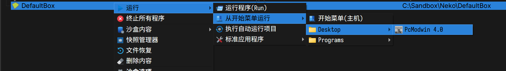
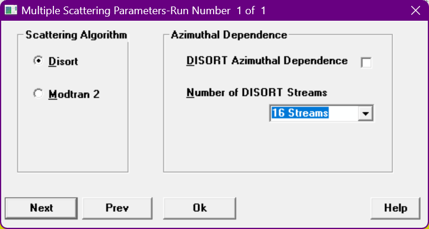
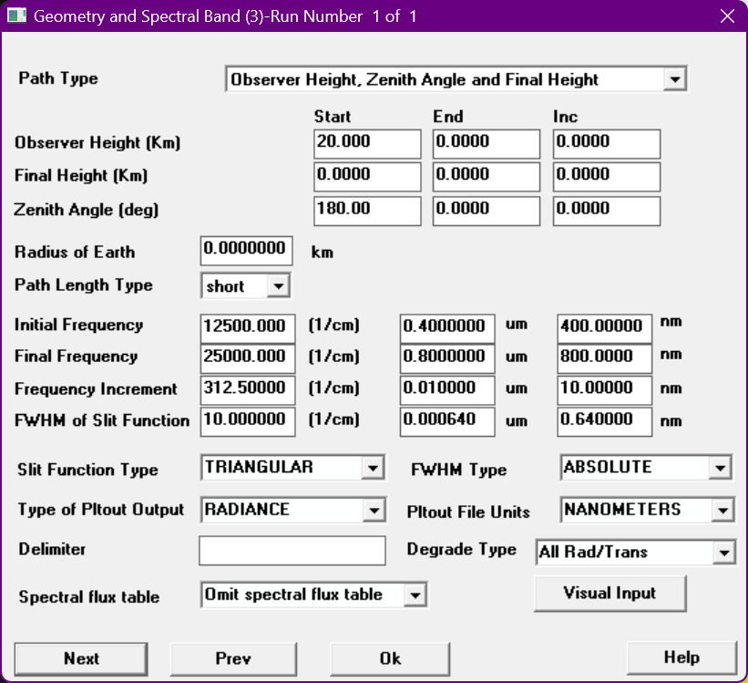
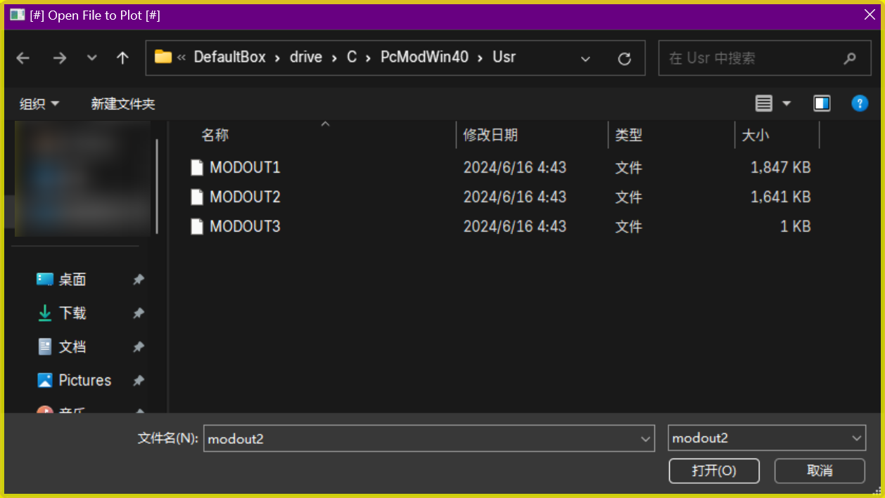
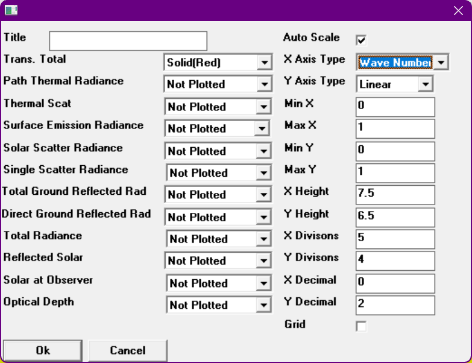
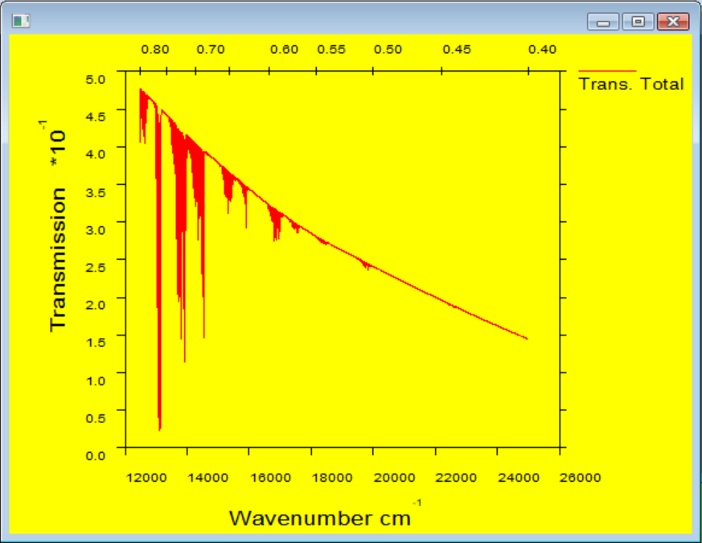

import Info from "@/components/98/Window.astro"

MODTRAN (**MOD**erate resolution atmospheric **TRAN**smission) 是一个大气辐射传输仿真软件。

## PcModWin 4.0

### 安装

在 Windows 11 上直接运行安装程序，会没有任何反应。

推荐使用 Sandboxie-Plus。

安装过程全部默认 <button><u>N</u>ext ></button> 即可，默认会安装到 <samp>C:\\PcModWin40\\Usr</samp>。

### 运行

在沙盒中运行：

### 仿真

#### 加载模型

加载默认模型，点击 File > Open，选择 <samp>CaseM01.ltn</samp> 即可。

#### 设置参数

点击 <button>Card1_input</button> 可以设置参数。

<Info title="Info: Standard Atmosphere">

6 种标准大气模式是美国空军地球物理实验室（AFGL）建立的较全面反映大气随地理和季节变化特性的参数模式：

- 1976 年美国标准大气（US Standard Atmosphere 1976）
- 热带（Tropic）
- 中纬度夏季（Mid-latitude Summer）
- 中纬度冬季（Mid-latitude Winter）
- 近北极夏季（Sub-arctic Summer）
- 近北极冬季（Sub-aratic Winter）

</Info>

第一页调整模型的大气参数。比如，可以设置大气模式为 6 种标准大气模式中的一种。

第二页默认即可。

第三页设置散射算法，默认为 <input id="radio6" type="radio" name="first-example" />
    <label for="radio6"><u>M</u>odTran 2</label>。调整为 <input id="radio5" type="radio" name="first-example" />
  <label for="radio5"><u>D</u>istort</label> 可以设置为 x 流近似。

Disort 注意事项
如果你使用 Disort，推荐设置为 16 流，其他在 Windows 11 上可能无法运行。此外，仿真时命令行可能会多次卡住，此时按下 <kbd>Ctrl</kbd> + <kbd>C</kbd> 即可。

第四页设置表面参数，默认即可。

第五页设置太阳辐射参数，默认即可。

<Info title="Info: Aerosol">

大气气溶胶粒子是指在大气中悬浮着的各种固态、液态和固液混合态的微粒，其粒径一般为 $0.001 \sim 100$ μm。气溶胶粒子既有海洋溅沫、土壤和矿物质、生物圈以及火山活动自然形成的，也有化石燃料和生物质燃烧、工农业生产等人类活动产生的。

</Info>

第六页设置气溶胶参数。第一项 Aerosol Model Used 可以设置能见度，比如 23 km 和 5 km。

第七页设置几何和光谱参数。比较重要的：

- 观测的天顶角（Zenith Angle / deg）：默认为 180，即垂直向下。
{/* - 初始频率（Initial Frequency）：默认为14000。可以根据波长设置。这里我们将第二个输入框设置为 0.4 (um)。频率和后面的 nm 单位会自动计算。 */}
- 初始频率（<label for="init-freq">Initial Frequency</label>）：默认为 <input id="init-freq" type="text" value="14000" />1/cm。可以根据波长设置。这里我们将第二个输入框设置为 0.4 (um)。频率和后面的 nm 单位会自动计算。
{/* - 最终频率（Final Frequency）：默认为 34000。可以根据波长设置。这里我们将第二个输入框设置为 0.8 (um)。频率和后面的 nm 单位会自动计算。 */}
- 最终频率（<label for="final-freq">Final Frequency</label>）：默认为 <input id="final-freq" type="text" value="34000" />1/cm。可以根据波长设置。这里我们将第二个输入框设置为 0.8 (um)。频率和后面的 nm 单位会自动计算。
{/* - 频率间隔（Frequency Increment）：默认为 100。可以根据波长设置。这里我们将第三个输入框设置为 10 (nm)。频率和 um 会自动计算。  */}
- 频率间隔（<label for="freq-inc">Frequency Increment</label>）：默认为 <input id="freq-inc" type="text" value="100" />1/cm。可以根据波长设置。这里我们将第三个输入框设置为 10 (nm)。频率和 um 会自动计算。

第八页设置日月参数，可以更改太阳天顶角（Solar Zenith Angle / deg），默认为 60。

#### 运行仿真

点击 Run Model > Run Modtran 即可开始仿真。

#### 查看结果

### 结果分析

我们需要手动找到输出的数据。右键所用的沙盒，点击「沙盒内容」>「浏览内容」，找到 <samp>drive\C\PcModWin40\Bin</samp>，用编辑器打开。

在第 11 行开始，会有如下的 tsv 输出：

<pre style="overflow: scroll; position: relative; height: 12em; padding: 0; resize: block; max-height: 40em;">
<samp style="text-wrap: nowrap; position: absolute; margin-inline-start: 1ch;">
……
</samp>
</pre>

