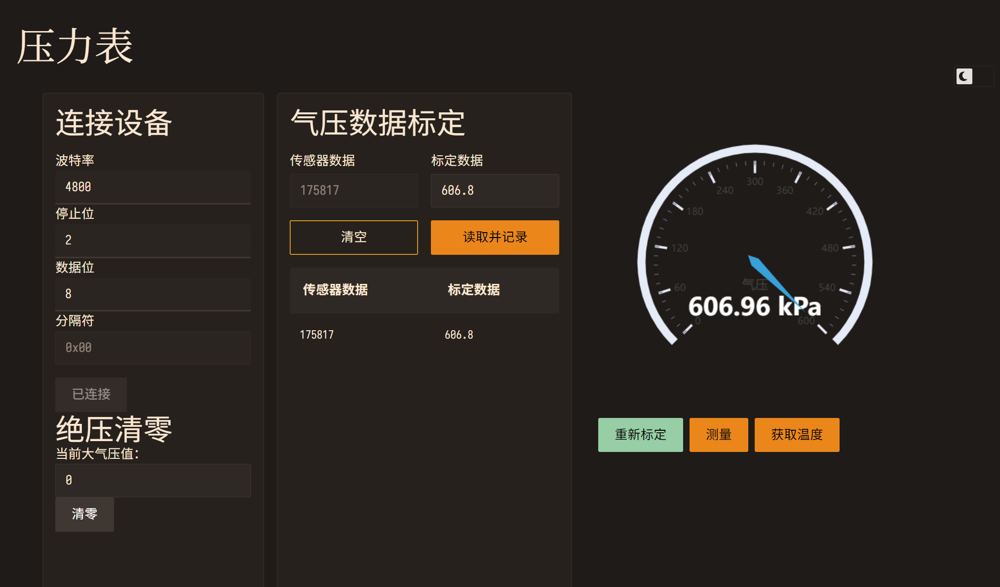

import "./style.css";

<aside class="lg:float-right lg:ms-4" style="margin-block-start: -1em; margin-block-end: -1em;">
<figure class="lg:inline-block">
  
  <figcaption>不懂体系结构，但计算机处处是前端</figcaption>
</figure>
</aside>

import Tweet from "astro-tweet";

<Tweet id="1809085263110365233" />

这几天调试压力传感器，发现 Web Serial API 着实很简单，惟需注意以下几点：

1. 这是一个面向浏览器的 API，挂在 `navigator` 上，所以需要请求权限。请求权限成功后，会拿到一个 `Port` 对象。
2. 需要拿一个 reader 和 writer，并且只能有唯一的 reader 和唯一的 writer。必须要在写入数据前拿到 reader，否则可能拿不到写入后立即返回的数据。
3. 读写的都是字节流（`Uint8Array`），这个很好理解。
4. 写完数据记得调用 `writer.releaseLock()`。
5. 读数据返回的是 `Promise<ReadableStreamReadResult<R>>`，有 `value` 和 `done`。注意如果 `done` 为 `true` 可能 `value` 还是有内容，注意不要忘记处理。
6. 你需要在循环里一直 `read`。鉴于串口的协议一般都是 ASCII，JavaScript 也不对字符串作出校验，所以在拿到每一次 chunk 后立即转换成文本也无妨。或者，把 reader `pipeTo` 一个 `TextDecoderStream`。
7. 由于 JavaScript 一贯的事件驱动的 API 设计，不可避免地用到异步。所以为了避免竞态条件，建议你使用 [`async-mutex`](https://www.npmjs.com/package/async-mutex)，创建一个 Mutex 然后把每次的读取和写入放在 `.runExclusive(async () => { return ... }) ` 里，并且 `await` 其结果。

## 题外话

简单做了一个测量的界面，如下。

这个界面是用 Svelte 的 UI 框架 [Skeleton](https://www.skeleton.dev/) 写的，需要配置 Tailwind。不理解为什么要对很多 tag 要手写一个同名的 class（如 `.input` for `<input>`），然后我的代码里一个 tag 就变成了好几行。也算是第一次理解了为什么切换暗色模式还涉及到[服务端渲染](/ssr-alignment-chart)这种破事。

右边的表盘当然是用 ECharts（[svelte-echarts](https://github.com/bherbruck/svelte-echarts)），不过我第一次看到表盘觉得不应该塞到这么一个面向于统计图表的库里去，没想到这么快就用上了（打脸）。

以及，终于发现，如果你像我很讨厌 SvelteKit，正确的方法应该是用 Vite 创建一个 Svelte 应用。（Svelte 4 不管是创建项目还是 lib 都不合时宜地强迫你用 SvelteKit，让你写不了单页应用。）
