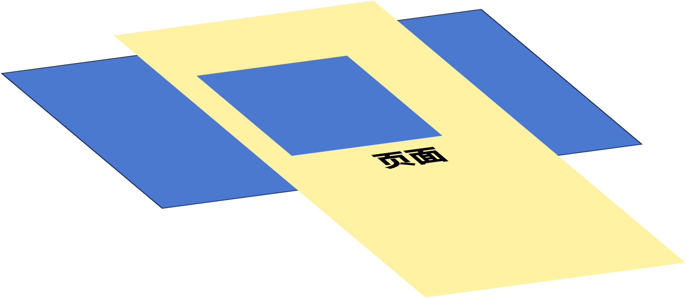
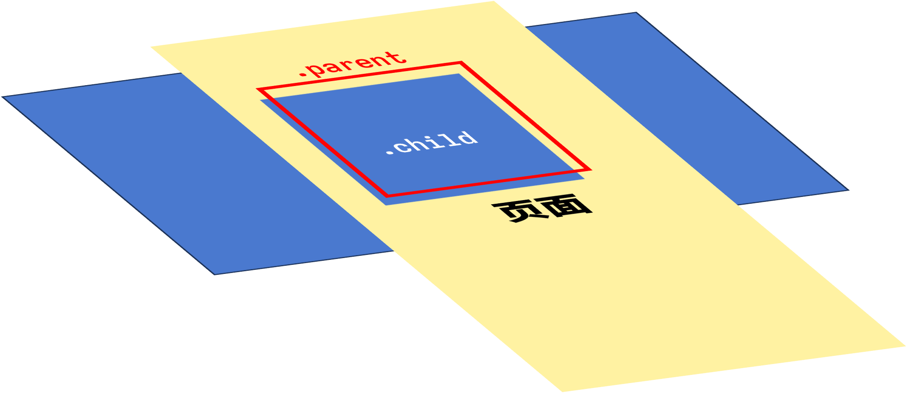
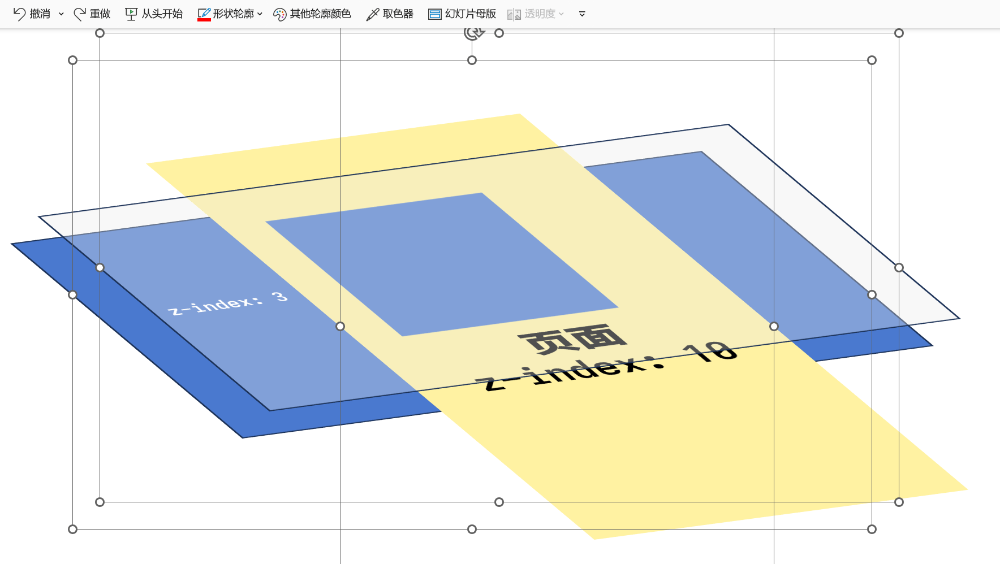
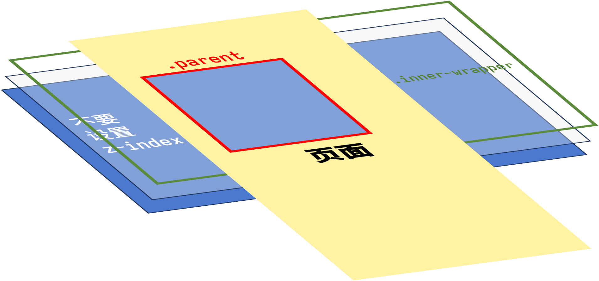

import Bilibili from "@/components/Bilibili.svelte";
import Pn from "@/components/Pn.astro";
import { YouTube } from "@astro-community/astro-embed-youtube";

<script src="/scripts/jxl/jxl.min.js" />

为了记录自己的精神状态，我决定开始写周报。说是周报，但不保证每周都会写，也不保证内容的跨度刚好是一周。名称来源于交响曲 <i lang="cs">Z nového světa</i>。

## 我在写什么

这周 Wakatime 时长 40 小时，时间都花在了重构博客和折腾 pdf.js 上。

重构博客用了 Astro，之后会写一篇文章锐评一下。

### CSS 如何裁剪一个元素



在 CSS 中，如果我们想要使一个元素只显示一部分，可以通过设置 parent 元素 `.parent {position: relative;}{:css}`、child 元素 `.child {position: absolute;}{:css}` 来实现。（tribute to @<Pn>魔法小猫</Pn>）



不过是次的情况有些棘手：child 是两个元素，其中一个元素 A 在另一个元素 B 之上，设置了 `z-index{:css}`。这导致即使 parent 设置更高的 `z-index{:css}`，也无法覆盖掉 child 的 A。



正确的做法是，不要设置 A 元素的 `z-index{:css}`，而是加一层 wrapper，并且将 A 和 B 都采用 absolute 定位来实现层级的效果。这样就不会出现上述的问题了。



<p class="codepen" data-height="300" data-default-tab="html,result" data-slug-hash="xxQYEaW" data-user="overflowcat" style="height: 300px; box-sizing: border-box; display: flex; align-items: center; justify-content: center; border: 2px solid; margin: 1em 0; padding: 1em;">
  <span>See the Pen <a href="https://codepen.io/overflowcat/pen/xxQYEaW">
  Crop-component</a> by Overflow Cat (<a href="https://codepen.io/overflowcat">@overflowcat</a>)
  on <a href="https://codepen.io">CodePen</a>.</span>
</p>
<script async src="https://cpwebassets.codepen.io/assets/embed/ei.js"></script>

### Svelte 4

Svelte 4 创建新项目只能选 SvelteKit / library 了，library 里还带一个 SvelteKit。虽然声称支持 SPA，但是[不支持 hash-based routing](https://github.com/sveltejs/kit/issues/7443)，这样你就用不了它的路由了。第三方库也只支持到 Svelte 3。而且 Svelte 4 的空白项目直接加入 SSG 的 adapter 还会报错，无法 build，貌似是里面有动态 endpoint。而且报错甚至倒退了，出错常常 trace 不到我的代码中。

React 最近也在推 RSC，文档中一上来展示了 4 个不同的框架（包括 Expo 什么的），要是初学者的话真的会被吓住。真是恶心它妈给恶心开门。

### pdf.js

pdf.js 分为 3 个层级：Core，Display，Viewer。Display 提供了渲染 canvas 和文字层的功能，Viewer 则是 Firefox 那个带控件的 PDF 阅读器。尝试使用 Viewer，但是始终无法使它正常工作。

Display 层中可选择的文字是由 `textLayer{:css}` 层提供的。使用方式也很扭曲，有几个注意事项：

- 导入的方式是 `import type { PageViewport } from 'pdfjs-dist';{:ts}`
- 需要设置 worker（不知道如何从包导入）：
  ```ts
  pdfjsLib.GlobalWorkerOptions.workerSrc = `//cdnjs.cloudflare.com/ajax/libs/pdf.js/${pdfjsLib.version}/pdf.worker.js`;
  ```
- 页面的坐标原点在左下角。典型的 PDF 文件的大小为 $612 \times 792$
- 需要引入 `textLayer{:css}` 的 CSS：
  ```html
  <link
      href="https://cdn.jsdelivr.net/npm/pdfjs-dist@3.8.162/web/pdf_viewer.min.css"
      rel="stylesheet"
  />
  ```
- 需要在渲染 `textLayer{:css}` 前设置 CSS 变量 `--scale-factor{:css}` 使 `textLayer{:css}` 缩放与 canvas 一致。
- `textLayer{:css}` 的默认 CSS 还设置了 `opacity: 0.25{:css}`，我建议覆盖掉，然后直接设置高亮颜色的透明度。

pdf.js 开发的困难之处还在于其提供的 API 少得可怜。比如，想要获得用户的选择，只能通过和 HTML 一样的方式来实现，即 `window.getSelection(){:js}`。

这周的成果如下：

<video src="https://raw.githubusercontent.com/OverflowCat/blog/test_a/imgs/weekly/0x01/Pdfdemo.mp4" autoplay controls></video>

## 我在玩什么

### 八方旅人Ⅱ

这周照例是玩《[八方旅人Ⅱ](https://zh.wikipedia.org/wiki/歧路旅人II)》。与第一作相比，这一作的每章节内容多寡分配得不是十分均匀。比如 Osvald 的前两章都是回忆，而 Throné 的第二章很短，还没有战斗。不过，类似观影的剧情多了起来，颇有以前 66RPG（奠）中「[R 剧](https://cowlevel.net/question/1873716)」的味道。


### LunarVim

尝试了下 LunarVim。文档里只说了加了哪些插件，但没有一个快速上手的教程，我都不知道它包管理器用的哪个。

## 我在看什么

[为啥你数学没有更强](https://zhuanlan.zhihu.com/p/642001589)（[<i>Why ain'tcha better at math</i>](https://wiki.issarice.com/wiki/Why_ain%27tcha_better_at_math)）

> 然而，我认为我的基本观点是好的。如果我的方法有任何价值，那么使用它的人应该能够学习并记住重要的东西。事实上，我对那些热衷于生产力/生活黑客的人有这样的批评：如果你的「记笔记方法/学习方法/待办事项列表系统/生活方式/无论什么」真的那么好，那么，你的成果是什么呢？你用它做了什么？所以我确实觉得我需要证明我在数学方面很好/过得去，不一定是从常规的角度，但至少是从某些特殊的角度上说，我对之感到满意，且任何一个公道的人都会对之满意。

---

### I tried 8 different Postgres ORMs

<YouTube id="https://www.youtube.com/watch?v=4QN1BzxF8wM" />

FireShip 的视频质量一如既往地高。看下来还是 Prisma 最好。去年用过一次，但是当时用的 SQLite，没体会出它的好处，现在用 PostgreSQL，migration 就很方便了。

---

### 番剧

- [x] **【推しの子】** EP11

---

<Bilibili client:load bv="BV1PV411T7yG" thumbnail="https://raw.githubusercontent.com/OverflowCat/blog/test_a/imgs/weekly/0x01/少女周末旅行.webp" />

<p lang="ja">作りましょう　作りましょう<br />
あなたと私の世界をさぁ作りましょう<br />
始めましょう　始めましょう<br />
なにから始めましょう（ん～！？）<br />
踊りましょう　踊りましょう<br />
ノリノリで踊りましょう（イェイ　イェイ）<br />
しゅうまつ旅行がはじまるぞ！<br /></p>
