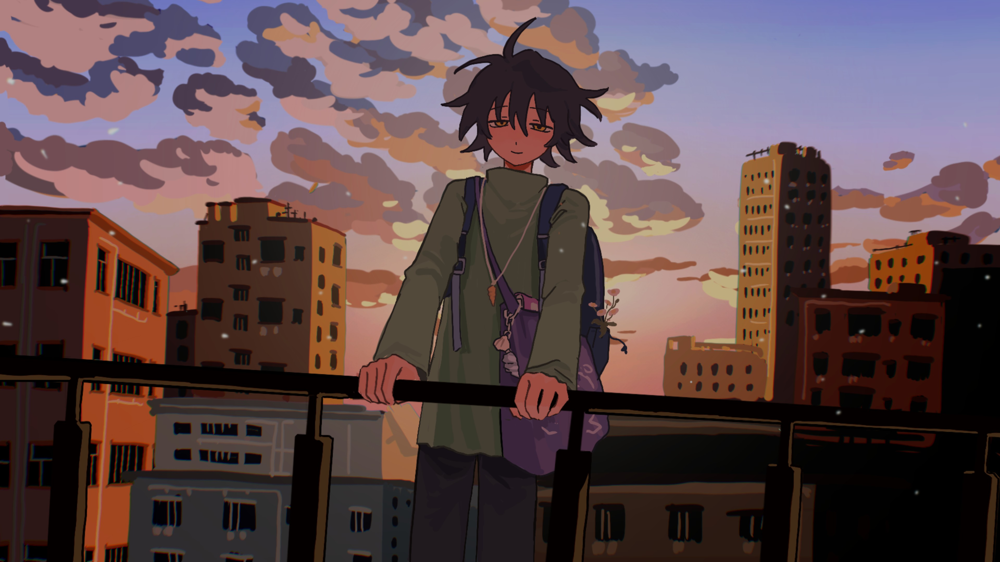

import "@/styles/abbr.less";
import { Spoiler } from "spoiled";
import "./style.less";

关心的读者一定已经发现了：我已经一年没有更新周报了。不过，虽说是周报，但是:j[哪个]{m=谁}说要每周都写，写的还是当周的事呢？我想过写成月报，但是周这个单位确实比较轻松。如果是月报，周期太长，要攒一个月的内容，太少了不好给列位读者看的，那:j[杠]{m=个样}子压力更大了。总之是不能再拖了，以下就当作作业交:j[脱]{m=掉}。

本篇的题目是指被学校拉去当帕鲁了😭。写这篇也用了不少的时间（可能主要是调 CSS）。什么？你问 0x03 跟 0x04 在:j[哪块]{m="la²¹ (kʰ)uɛ⁵³，哪里"}？当然是没有写完啦。

## 我在写什么

### 博客更新

你应该已经注意到本博客部分文章（包括本文）的开头的角落里多了三个按钮，分别是字词转换、[直书](./#vert)和[横书](./#博客更新)。

简正转换是通过 opencc-js 实现，因为 opencc 在我:j[这块]{m="tsəʔ⁴ kʰuɛ⁵³，这里"}因为 [C++ 代码出包](https://github.com/BYVoid/OpenCC/issues/883)的原因装不上。

### 直排布局

<script async src="https://telegram.org/js/telegram-widget.js?22" data-telegram-post="TypeChat/117431" data-width="100%"></script>

直排文本可能会有一些布局问题：

- 需要 Chrome 108+。考虑到鸿蒙 WebView 和 ArkWeb（我把它们当作基线）已经分别 115 和 114 了，所以不管 fallback 了。
- 图片可能会 distort，需要额外包一层 div 解决。我暂时懒得处理，摸索看下子:j[有不得]{m="有没有"}更好的办法。
- 移动端可以上下滑动，<del>不晓得何故</del><ins>已经<a href="https://github.com/OverflowCat/blog/issues/588">修复</a></ins>。

### Astro 的 Typst 插件

另外，我还尝试了将 [Typst](https://github.com/Myriad-Dreamin/typst.ts) 引入 Astro 生态。[上一篇文章](regression/)便是一个例子。你也可以看看[测试页面](/test/typst)。

<aside class="float-end bg-[#ddd] shadow p-4 m-4 max-w-100 text-sm">

<hgroup>

<h3>[GitHub - OverflowCat/astro-typst: Typst integration for Astro](https://github.com/OverflowCat/astro-typst)</h3>

Typst integration for Astro. Contribute to OverflowCat/astro-typst development by creating an account on GitHub.

</hgroup>


</aside>

感谢 Typst.ts 的作者，Node compiler 会自动下载所需的依赖，所以很轻松地已经支持了：

- [x] 从 Typst Universe 引入包
- [x] 使用系统字体
- [x] 可选中、可点击的文本层
- [x] 设置缩放（需要使用 `<Typst>{:jsx}` 组件）
- [x] 静态 SVG（不需要 JavaScript）

正在进行的工作：

- [ ] 响应式 SVG
- [ ] 手动添加字体文件或 blob
- [ ] ``.typ`` 文件中的 Frontmatter

跟作者聊了下，了解了 query 之类的数据流，所以以上功能应该都有戏。实现细节我会在之后专门写文章讲述，不过欢迎使用。以及感谢已经用上了的[群](https://with.fish/posts/typst-test/)[友](https://blog.cloudti.de/posts/tensor/)们的反馈
<lottie-player class="inline-block mbe--2 vertical-btm w-8 h-8" src="/lottie/utyaduck_agaddqeaaladvqo.json" mode="bounce" background="transparent" speed="0.9" loop autoplay></lottie-player>。

## 我在用什么

### Zed

尝试使用 Zed。Manjaro 的 `zed` stable channel 里面的版本是 2.6.0，而我需要 3.0.0 以上的版本。所以我用了 AUR 的 `zed-preview-bin`，这个版本是 3.0.0 的 preview 版本。

然后发现确实比较简陋。即使是写前端也缺很多东西。插件的能力忒少，目前只能添加 theme 同 language。

有 [WakaTime 插件](https://github.com/ewen-lbh/zed-wakatime)可以用。但是询问群友得知依赖 `wakatime-lsp` 的编辑器对于时间的统计貌似都是看编辑器开了多久，不如官方的细致。

## 我在逛什么

去小米之家摸了摸 MIX Flip 和 MIX Fold 4，发现后者和我的 11 Ultra 厚度差不多。


## 我在看什么

### 寂静之地：入侵日

<Neodb item="movie/3adZY5rDUjhwJZ1MW6hO0E" />

前两部也是在影院看的。看这三部的时间分别是在:abbr[瘟疫]{title="COVID-19 大流行"}前中后。这部感觉时间上没那么长。家庭主题其实并没有变，只不过是从双方互动的视角转变为了个人对亲情和爱情的珍视。一块披萨（还有猫猫）当然可以是对生活的全部寄托。人们<em>应当</em>想象主角摘下耳机时是幸福的。

### 从21世纪安全撤离

<Neodb item="movie/4Duee1acBlZt1atfut5rrg" />

一部观感比较惊艳的电影——至少是视觉上。风格被评价是中式梦核。动漫元素的穿插给人一种魔幻现实的感觉，即便我不是很欢喜。讲述了一个一群人一次次尝试改变未来而又徒劳无功的故事。作者对这个结局的回应是主角天真地喊「一定不要变坏啊！」，我觉得还是换一下形式比较好。不过存在主义的内核其实不一定要对精神困境给出答案。

一个缺点是设定，无非是一个看上去更黑暗一点的地球，犯不着弄得陌生。K星的虚构设定并没有起到什么作用，加重了认知负担。譬如，既然本身已经这么疯癫了，就算说那种五颜六色的蛤蟆是地球上的生物也是没有什么问题的。

全片最大的败笔是其精美的视觉风格和相对较高的立意都难掩顺直人对青春和爱情刻板而贫乏的想象。这可能也是我不能理解剧中所卖的情怀的原因之一。

### 解密

<Neodb item="movie/06WDIK5w49jE3HjBHN7Jqg" />

患有自闭症的数学天才容金珍自小被家族中的小黎黎收养。在1949年大学入学之际，第一节课就解出希伊斯老师布置的难题而被收为学生。其间<Spoiler client:load={true} >在共产党特务郑某的劝说下破解了加密报文。由于国民党政府的撤离，希伊斯一家前往美国，而容金珍因中弹留在了中国。中华人民共和国成立后，又被郑某招募至秘密间谍机构701局成为一名解密者，通过释梦先后破解了数十个密码，包括美国所研制的「紫密」和「黑密」，which 都是希伊斯设计的。然后这一下就在秘密基地待到了文革才被允许出去一次，私人通讯也被截获并代为回答。</Spoiler>

——作者似乎毫不犹豫地就把郑某等人塑造成了反派的形象。我也从一开始就不能理解这:j[六不搭对]{e="牛头不对马嘴。也写作「六不答对」"}的剧情。矛盾得连逻辑都不能自洽——前半部分的「反战主题」明显是和「家国情怀」冲突的。突兀的说教和主角木讷的表现并不能感染观众，半推半就的逼迫更让人感觉恐怖。

其他方面，布景不错，后半部分对梦境的描写过于冗长。

### 抓娃娃

<Neodb item="movie/1O3OM5a0GELT6BtF7KEtUp" />

import Sic from "@components/Sic.astro";

主要讲了一对富豪夫妻为了防止<Sic reason="电影里这么说的">「小号炼废」</Sic>，招募了一整个团队将其小:j[霞子]{m="细伢子，孩子"}置于一个表演出来的逆境中。你可以看到一些关于应试教育的戏剧性表现，比如在各种场合:j[霞子]{m="细伢子，孩子"}都会被伪装成其他职业的人的团队中的老师要求解答一个奥数题，无处不显示对教育和考试的迫切心态。终于在<Spoiler client:load={true}>高考时，主角选择了提交交卷，伪造被绑架的假象，进而发现了秘密。</Spoiler>虽然是关于教育的，但是影片中少有出现学校内的剧情，而是着重于:j[霞子]{m="细伢子，孩子"}在校外的成长中。

然而，如果影片想要通过这种方式来讽刺教育的现状，那我觉得它目的没有达到多少，反倒体现了中国式家长的恐怖。无论你多么成功，最后都要以这种自我感动的方式将控制欲加在孩子身上，何必呢。片中:j[霞子]{m="细伢子，孩子"}拿了家里的钱买平板电脑耍，准备七天无理由退货，但家长却在背后:j[黢咙]{e="不光明不正大，背后偷偷搞小动作"}，让人往平板上:j[戽]{m="泼，倒"}水，这已是主动作恶了。如果真的是按成功学教育的话，利用规则也并无坏处。

假使欺骗的时间没有那么长，最后一部分的剧情更戏剧化一点，兴许还没那么膈应。但末了<Spoiler client:load={true}>长大了的主角在运动会上童年阴影复发，开心地捡起了地上的瓶子，哥哥也和男朋友成功登顶珠峰，</Spoiler>而夫妇而人坐在电视前的沙发上，只是哈哈大笑，转头说要再生一个，这就让我感到的恐怖了。影片并没有体现出夫妻的后悔，反而看着是:j[无理不故]{m=无缘无故}地和解了，没有体现出:j[一点个]{m=一点儿}对这种成功学叙事的批判，搞笑中透露着麻木才是最发指的。如果快乐的生活全是虚伪，那还不如痛苦的真实。

重新回到教育上来。即使你对东亚的教育深恶痛绝，但你却会把主角不能完成高考和比赛看得比剧中家长更重，我想这才是这部电影真正的讽刺之处吧。

## 我在玩什么

### 尼尔：机械纪元

<Neodb item="nier-automata" />


打完了序章，欢喜这:j[杠]{m=个样}子的废土风格，视角的转换设计得也很精巧，但打 BOSS 时死掉好几次。之后任务之类的感觉比较复杂了，闲下来再推。

### 幻兽帕鲁

<Neodb item="palworld" />

没玩多久，感觉前期有点枯燥。


树和石头很容易就采集完，然后要跑到比较远的地方。食物好难收集。

### 蔚蓝

<Neodb item="celeste" />


去年听了一整年 Lena 的作品。欢喜 <i lang='en'>Reach for the Summit</i> 响起的时候。

可能因为游戏的场景是 2D，在 Linux 下运行流畅很多，风扇没什么声响。

为了拿心看了很多教程，速通确实有意思。


游戏最大的缺点是其像素风格并不出彩。不同关卡的色调看起来很混乱，游戏中的道具（比如气泡和金币）也很突兀。从地图到远景的绘制都只能说有特色但不好看。

对 ADHD 不是很友好，大地图经常跑得晕脱，然后错过部分房间，有很多时候还会有门把你挡住，不让你回去。

默认的 ```Z``` ```X``` ```C``` 和方向键感觉不是很合理。发现 ```W``` ```A``` ```S``` ```D``` 和 ```J``` ```K``` ```L``` 应该更好，但是习惯已经改不过来了。按得手疼。

Tips：获取磁带的关卡听音乐跟:j[到]{m=着}节奏非常有帮助。经常用「第几拍的 $1/2$ 之前一点点」这:j[杠]{m=个样}子的描述（像不像倚音？）来判断跳跃时机。


<iframe class="w-150 h-50 m-auto block" src="https://store.steampowered.com/widget/504230/?utm_source=xinshijiededamen"></iframe>

### 1比1食用人形

import Neodb from "@/components/embed/Neodb.astro";

<Neodb item="game/4pOgy2d3N1pjL3qXEOhSOs">

关于模糊的爱意、食欲、撕咬欲的故事。

<details>

<summary>人物介绍</summary>

| 主角       | 描述                             |
| ---------- | -------------------------------- |
| 罪里央     | 似乎认为自己和其他人没什么两样。 |

| 可恋爱角色 | 描述                             |
| ---------- | -------------------------------- |
| 知沙渡     | 作为朋友，真是米其林级别的美味！ |
| 米霖       | 小虫子，一口吞掉也不会被发现     |
| 梨爱       | 他在撒谎吗？要咬一口吗？         |

</details>

</Neodb>

这年头:j[哪块]{m="la²¹ kʰuɛ⁵³，哪里"}还有新上架的游戏容许是 32 位的…只好安装平行桌面（融合模式挺好用的，不过没法按 ```F12``` 截图）。查了下子，Ren'Py 明明都支持 Apple Silicon 了。


剧情很短的情况下有些部分感觉比较水。差分不少，但背景图比较少。没懂前面几个选项间的意图，看起来进入知沙渡线的条件比较苛刻。

import BlurSpoiler from "@/components/BlurSpoiler.astro";

<BlurSpoiler>

</BlurSpoiler>

画风真的很能激发人的撕咬欲，都好可爱🤤。上一次玩可爱风的 gore 游戏还是 [<i lang='en'>what body?</i>](https://neodb.social/game/7gaDw5gkBBfEI4ildMnemP)，用 RPG Maker MV 做的，画面和音乐都更加:j[欢<span class="color-transparent absolute left--20">⿰</span><span class="inline-block" style="transform: scale(.8,1); margin-left: -2px;">忄</span><span class="m--2 inline-block" style="transform: scale(.65,1); margin: -12px; margin-right: -1px;">叜</span>]{m="欢快"}。

<iframe class="m-auto block" frameborder="0" src="https://itch.io/embed/2390774" width="550" height="178"><a href="https://bun-tired.itch.io/what-body">what body? by bun_tired</a></iframe>

<script src="https://unpkg.com/@lottiefiles/lottie-player@latest/dist/lottie-player.js" defer />

除了以上内容，我其实还有很多没写，但暂时也没什么想说的了。长篇大论确实很劳神，我也觉得这篇已经够长了。那么再会！
