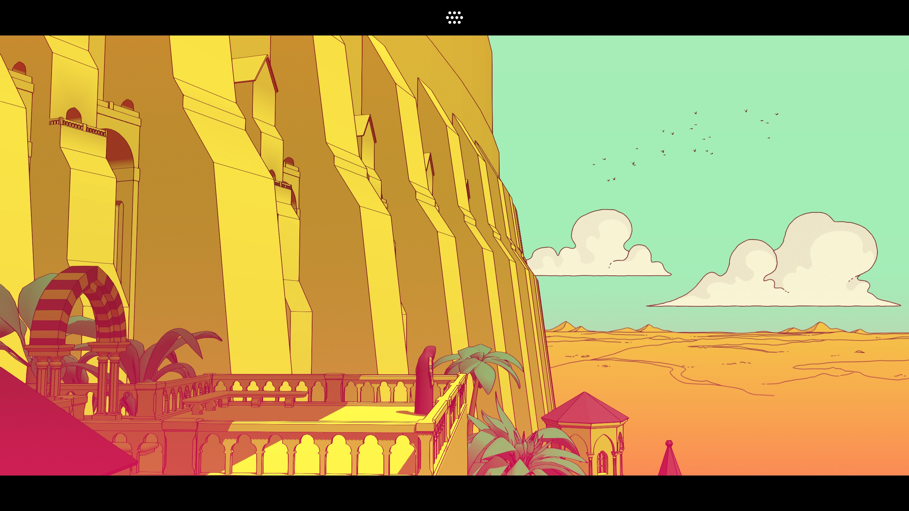
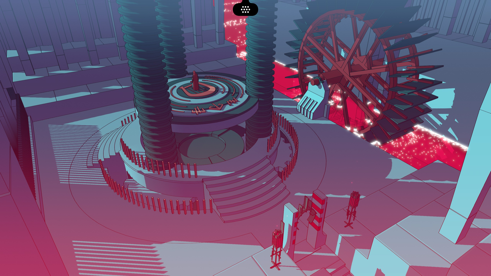
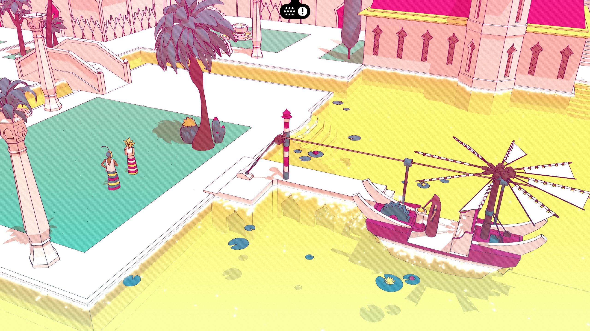

import FloatingImg from "@/components/FloatingImg.astro";

<FloatingImg
  src="https://github.com/user-attachments/assets/6f43679b-fca4-4ea1-82fe-ca99b6b90181"
  alt="A detailed anime-style illustration of a programmer living on an abstract syntax tree (AST), inspired by the art style commonly found on Pixiv. The tree has branches and nodes resembling abstract elements of loops, branches, and other coding structures. The programmer is portrayed as an anime character, sitting on one of the branches with a laptop, surrounded by floating abstract code symbols, lines, and shapes representing different coding structures. The background features an abstract, colorful representation of loops and branches in a flowing and dynamic pattern, blending seamlessly with the tree, giving a sense of a digital world merging with the anime aesthetic."
  width="250"
  height="218.25"
>
  生活在 AST 上
</FloatingImg>

## rehype-remnote

写了一个可以从 [RemNote](https://www.remnote.com/) 导出的 ``.rem`` 文件中生成 [hast](https://unifiedjs.com/explore/package/rehype-remark/#what-is-this) 的 [包](https://www.npmjs.com/package/rehype-remnote)。hast 是 rehype 所用的抽象语法树，实际写下来感觉还是挺方便的。

### ``.rem`` 文件结构

新的 ``.rem`` 文件本质是一个 ``.tar.gz`` 压缩包（以前则是 ``.zip``），解压后有一个 ``rem.json`` 文件，里面包含了所有笔记的内容。应该是为了节省空间，所以这个 JSON 中很多字段的名称都很难以分辨。于是写了一个测试各种样式的页面，导出看效果，根据效果修改代码。

文件的结构大概是这样：

```ts
type Workspace = {
    userId: string;
    knowledgebaseId: string;
    name: string;
    exportDate: string;
    exportVersion: number;
    documentRemToExportId: string;
// @noErrors
    docs: Doc[];
}
```
整个 ``docs`` 的结构是扁平而有序的，通过 ``_id`` 来找到对应的内容。对于单个 `Doc`，主要的内容在 ``.key`` 中。``.key`` 中存储的内容是 `(string|object)[]{:ts}`。对于一张卡片，如果有涉及到闪卡的部分，可能会把背面的内容放在其他地方。

一些特殊的 block 类型会存储在几个特殊的 block 中，比如

```ts
type RemTypes = "Daily Document"
| "Document"
| "Automatically Sort"
| "Tags"
| "Template Slot"
| "Header"
| "Website"
| "Link"
| "Quote"
| "Image"
| "Code"
| "Card Item"
| "List Item"
```

### 如何使用

可以参考 [``Rem.astro``](https://github.com/OverflowCat/blog/blob/src/src/components/Rem.astro) 文件。

- 如果你只需要最后的 HTML，那么可以调用 `rem2Html`。
- 如果你需要将 ``rem.json`` 的内容提交到版本管理系统中，那么建议你先调用 `hydrate` 来生成一个精简的、树状的 JSON。
- 如果你想要走完整个 `unified` 的 pipeline，得有一个 parser 来初始化 unist：

```ts
import { unified, type Parser } from "unified";

function remParse() {
  const self = this;

  self.parser = parser as Parser;

  function parser(doc: string, file: unknown) {
// @noErrors
    return transformDoc(...);
  }
}

let processor = unified().
// @noErrors
    use(remParse).
//                ^|


```

如果你想要直接传 string 的话，可以跳过 [`process` 的步骤](https://github.com/unifiedjs/unified)，自行调用相应的 stage。

<style> #ascii-art pre {text-wrap: nowrap;} </style>
<div id="ascii-art">
<Code
lang="astro"
theme="vitesse-light"
code={`
| ........................ process ........................... |
| .......... parse ... | ... run ... | ... stringify ..........|

          +--------+                     +----------+
Input ->- | Parser | ->- Syntax Tree ->- | Compiler | ->- Output
          +--------+          |          +----------+
                              X
                              |
                       +--------------+
                       | Transformers |
                       +--------------+
`} />
</div>

`rehype-remnote/style` 提供了一些基础的样式，可以导入使用。

:h2[TypeScript 类型体操之一个 `Record` 要么有一组 kv 的全部，要么全部没有]{id="all-or-none"}

处理 ``rem.json`` 的时候发现很多时候结构体中的部分字段要么同时出现，要么同时不出现，遂有了下面的一些类型体操。你也可以[在操场上玩耍](https://www.typescriptlang.org/play/?#code/C4TwDgpgBAcg9gOwgeQGYB4DKA+KBeKAbwG0BpKASwSgGsIQ5UpMBdAfgC4okA3CAJwC+AbgBQo0JCgBBADazk-eEnQAhADTNcBVVABkzKAB8oug8pQYcY0QHp7Dxw-GToqgIYBnaAUKioAVDuXAgArgC2AEYC6v6BkVyewPxUAOaxgi7g0ABiEO7AmBDA+ERxAQDGIRHR-LGBUAAmiclpGVlSALIgACrZpXIKSogQal4QmnkFRcDY4hWISU0F7oNc3X1SvuVBXACM9fFcAEQATMeHlVwAzJdNJwAsx6KZogsIS40rFuu9-dsNYJQA47BJQM4XF7zRYlL7AdwABXc-GAFHcsl+mx8RCg9igngAFnBQrJGlBgAT+HAAO47IEghpgiF3KpQW5QuxOJwdaAAUQAHmB3AhGj04INFBYABIQWSQfjoHqaACq2igyqgEH5wAgIs8UGIVFQAigOU0ADpLUaTQAlFhxNhQAVCkViiXDJAyuUCdDuiyKybYTQ2uYBLg9GyuGTySUjTwB9Wa7W6xr64UgYgsNXO4Wi8Uxj0QL3yhOqyP9aQIOAUgRTQrFUp+BoQLiROBwWT5BB3VAndz947GcGREfPV5RjbZXQEP1xsbeTTEOszTSV6sE2v5evALM2d6fFYAdQoFLXNf4y+KmKnjbp+z25oedyZAFY9k87i3yfxQhMdr3wX7dwx2hD5YSPE8CQASQQBZwjATsdUvYBr0gaccTxQliVJclKRpO9gQfJ9QRON8P3-PsB3aN4YWWeFjwpGC4KFVFIk7ZDUIgdCm0CekiOfUj30hZsuGSX8exOU5rmuC5cVsfEiRJMkKSpWlBCAA)。

```typescript
type NoneOf<S> = {[K in keyof S]?: never};

type AllOrNone<B, S> = B & S | B & NoneOf<S>;

/////////////

type Base = {
    a: number,
    b: string,
}

type FeatSet = {
    c: number,
    d: string,
}

type MyType = AllOrNone<Base, FeatSet>

const dataAll: MyType = {
    a: 1,
    b: "2",
    c: 3,
    d: "4"
}

const dataNone: MyType = {
    a: 1,
    b: "2",
}

// @errors: 2322
const dataPartial: MyType = { // should throw
    a: 1,
    b: "2",
    c: 3,
}

///////////

type ExpandToAllOrNoneHelper<T, U> = U extends [infer F, ...infer R]
  ? ExpandToAllOrNoneHelper<AllOrNone<T, F>, R>
  : T;

type AllOrNones<T, U extends any[]> = ExpandToAllOrNoneHelper<T, U>;

type AnotherFeatSet = {
    e: boolean,
    f: "aaa" | "bbb"
}

type MyTypeB = AllOrNones<Base, [FeatSet, AnotherFeatSet]>;

const dataWithAnotherFeatSet: MyTypeB = {
    a: 11.4,
    b: "514",
    e: true,
    f: "aaa"
}

// @errors: 2322
const dataWithIncompleteFeatSet: MyTypeB = { // should throw
    a: 11.4,
    b: "514",
    f: "aaa",
}

const dataWithIncompatibleFeatSet: MyTypeB = {
    a: 11.4,
    b: "514",
    e: true,
// @errors: 2322
    f: "233", // should throw
}
```

:h2[如何在服务端（Astro SSR/SSG, etc.）使 UnoCSS 对动态字符串生效]{id="unocss"}

RemNote 中可以设置文字和背景的颜色，可以是预设的颜色，也可以是自定义的颜色。因此我对应生成了 Tailwind 的 class 名。

但是，原子化 CSS 框架 [UnoCSS](https://unocss.dev/) 作用的原理是使用正则表达式扫描<em>源码</em>来生成规则。为了防止最终的结果 diverge，所以不会扫描<em>产出结果</em>。这意味着在 Astro 中，即使是 SSG 模式下也无法处理 JS 动态生成的字符串。

### 例

```astro title="Bad.astro" {3}
---
const r = `<span class="text-red-600">红色</span>`;
const y = 'PHNwYW4gY2xhc3M9InRleHQteWVsbG93LTYwMCI+eWVsbG93PC9zcGFuPg==';
---
<div set:html={r} />
<div set:html={atob(y)} />
<div class="text-blue-600">蓝色</div>
```

（其中 `atob(y){:js}` 的结果是 `<span class="text-yellow-600">yellow</span>{:html}`）

<fieldset>
  <legend>渲染结果</legend>
  <div><span class="text-red-600">红色</span></div>
  <div><span>黄色</span></div>
  <div><span class="text-blue-600">蓝色</span></div>
</fieldset>

### 解决方案

`unocss` 提供了一个 `createGenerator` 方法，可以用来生成 CSS 字符串。

import { Code } from "astro:components"

```ts
import { createGenerator } from "unocss";
import unoConfig from "uno.config"; // 导入当前项目的 UnoCSS 配置

// ---cut-start---
/**
 * Generate UnoCSS style from HTML string
 * @param content HTML string
 * @returns CSS string
 */
// ---cut-end---
export async function generateUno(content: string, layer: string = 'default') {
  const generator = createGenerator(unoConfig);
  const style = await generator.generate(content);
  // 返回的内容为不同 layer 的 CSS 字符串，这里我们只用到了 default layer
  return style.getLayer(layer);
}
```

接着，在使用到的地方就可以调用我们的函数来生成 CSS 字符串了。

import gut from "@/pages/test/_Uno.astro?raw";
import Gut from "@/pages/test/_Uno.astro";

<Code lang="astro" code={gut} theme="rose-pine-dawn" />

<fieldset>
  <legend>渲染结果</legend>
  <Gut />
</fieldset>

## 我在玩什么

### 巴别塔圣歌

import Neodb from "@/components/embed/Neodb.astro";

<Neodb item="game/7HMaOPt7BBbNO0VYPFRvic" />

玩到了第三层。有些地方很关键（比如第二层第一次出现双语对照文本的时候），如果错过了就会卡关。





第二层的地图把我搞得晕头转向的。



破译的另一大难点是画得很抽象。

* * *

这两天由于 [Pulasan](https://zh.wikipedia.org/wiki/%E7%86%B1%E5%B8%B6%E9%A2%A8%E6%9A%B4%E6%99%AE%E6%8B%89%E6%A1%91_(2024%E5%B9%B4))，降温很厉害，搞得我感冒了。恍惚间让我回忆起去年（还是前年）的秋天玩《2077》的时候。

## 我在看什么

### 网络炼狱：揭发N号房

<Neodb item="movie/0SUHTGSSWmtMORBdfD31sx" />

分数都是给事件内的人物的。作为作品，表现手法比较欠缺。即使事件很大一部分都发生在网络上，但也没能看到一些像《网络迷踪》那样新颖的镜头设置，很多都是干巴巴的打字。

在技术上也有很多露馅的地方。比如，P 上去的右键菜单，레드팀用来钓鱼的背景的代码是原型链相关的操作。
