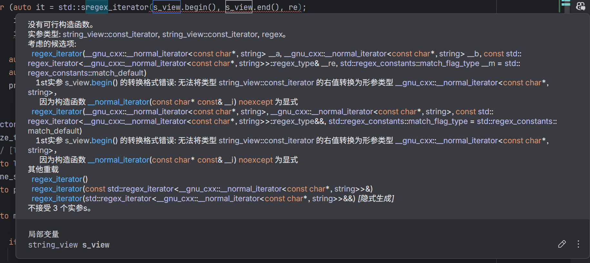

## 大蛋挞

在肯德基食用「巨大的蛋挞」（头图）。蛋挞变大之后的视觉效果的确惊艳，平滑的金黄色的蛋液因焦斑的颜色在灯光的照射下显得金波荡漾。

当然，对任何东西放大缩小並非只是简单的线性变换，但肯德基在设计上显然没有考虑到这一点。这样的缺陷有二，一是给了塑料手套和勺子，但用手太烫，勺子又不是非常坚固；二是蛋液显著比塔皮多，导致在吃了一半之后感觉很油，而塔皮既不脆也不厚，完全没有解腻的作用——这时候便知为什么套餐里有可以加两三文选的饮料了。

<Character
  name="美食之猫"
  sticker="pawlicking"
  colors={[
    "#a8b11c",
    "#98971c",
  ]}>

似乎别处的肯德基有售巨大的开心果蛋挞——快餐店是很少见那样的绿色的，这也让暗绿色的蛋挞显得更加诱人了喵。

</Character>

## C++

在用 C++ 完成编译器的词法分析。按评测机的要求，只有 Clang 12 用，支持了 C++ 17。

### 枚举

``enum`` 的 `impl fmt::Display{:rs}` 之类的东西似乎要到 C++ 23 才有。C++ 17 要么手写要么用宏，有 [Magic Enum](https://github.com/Neargye/magic_enum)。随手抄了个简单的宏结果运行时出错了。

import Chat from "@/components/chat/Chat.astro";

<Chat users={[
    {
      id: "jinser",
      name: "jinser kafka",
    },
    {
      id: "neko",
      name: "猫猫",
      you: true,
    }
  ]}
  messages={[
    {
      id: "267696",
      text: "你们念 enum 的时候，是念 i'nju / i'nʌm / a'nju / a'nʌm 哪个",
      time: "2024/9/25 8:33",
      sender: "jinser"
    },
    {
      id: "267700",
      text: "伊曩，伊纽么瑞特",
      time: "2024/9/25 8:35",
      sender: "neko"
    },
    {
      id: "267704",
      quote: "伊曩，伊纽么瑞特",
      text: "我也是这样的，但是我刚刚才意识到我念这两个不一样",
      time: "2024/9/25 8:41",
      sender: "jinser"
    }
  ]}>
    
  </Chat>

### 迭代器

迭代器也不好用。没有 `slice.window()`，导致判断两字符的运算符需要形如 `s[i] == '>' && s[i+1] == '='{:cpp}` 的代码。

没有 `iter.peek()`。流有，见 [`std::basic_istream<CharT,Traits>::peek{:cpp}`](https://en.cppreference.com/w/cpp/io/basic_istream/peek)。但是我觉得 `getchar()` 可能更加不方便。

这样一来，我还是通过传统的循环来实现了，结果就是指针经常跑飞…

### 切片

此外跟切片有关的还有 `string_view`。然而，``regex`` match 又用不了 ``string_view``，还要再转回 ``string``。下面是尝试用正则在 ``string_view`` 中匹配的报错：

还有，``unordered_map`` 创建的时候就要使用 ``string_view``，否则 ``string`` 和 ``string_view`` 是不被视作同一个类型的。

### 闭包

C++ 的闭包语法看起来复杂，但是其实用起来很简单，常用的就是 `&`（可修改捕获的值）和值捕获。

* * *

这么一想，Rust 折磨人的语法噪音几乎只有所有权引入的部分。如果你不为多线程和内存安全所困，使用 Rust 其实可以做到很好的抽象。

## 本博客

### 升级

Astro Astro 5.0 Beta 出来了，content layer 有大改，我觉得不错。但文档里说的是 Beta 的状态要等到 Vite 6.0 结束之后结束，没提根本没做完——

<figure>
  <video loading="lazy" src="https://github.com/user-attachments/assets/f5d04521-be22-4ec1-8f65-f5fccfd12794" controls autoPlay loop muted />
  <figcaption>{做神做鬼做到真}^(fake it till you make it)</figcaption>
</figure>

怎么好意思端上来的！

所以目前还是用的 legacy 的内容集合，不过感觉开发时首页面加载速度已经有不小的提升了。

### 暗色模式

import Baseline from "@/components/yari/Baseline.astro";

2024 Refresh
本站目前在部分页面增加了暗色模式。阁下可以在页面的右上角切换「亮色 / 暗色 / 跟随系统」3 种状态。由于是纯 CSS 实现，所以较旧的浏览器不支持，这时会退回到默认的亮色模式；此外在页面间切换，用户的偏好也不会保留。

<Baseline date={new Date("May 2024")} versions={
  {
    chromium: "123",
    gecko: "120",
    webkit: "17.5",
  }
} />

由于效果还不是很好，所以默认的还是亮色模式。做好了之后会写篇文章。

import Character from "@/components/Character.astro";

<Character sticker="inquisitive" name="前端之猫">

除了技术上，设计上也需要考虑很多东西，[Tailscale 最近的一篇文章](https://tailscale.com/blog/heart-of-dark-mode)指出了一部分。简而言之，取反后的颜色在人眼的感觉上并不相同；阴影、禁用按钮变灰等颜色和样式带有隐喻，难以找到替代品……

</Character>

另外，对 RSS 的生成方式做了些优化，现在的 RSS 应该不包含网站的导航条、样式等无用部分了，令我惊讶的是构建时间居然也减少了很多。

<Character sticker="rolling" name="前端之猫">

反正你们的破烂阅读器也不加载我精心写的 CSS！

</Character>

隔段时间再翻文档，能发现好多新东西。[{霍闪}^(Lightning) CSS](https://lightningcss.dev/) 似乎不支持 LESS、SCSS 等预处理器，并且我有大量的注释是用 `//{:js}` 写的，所以暂时先搁置。不过，其降级的思路倒是很有趣，有空我也会详细写写。
