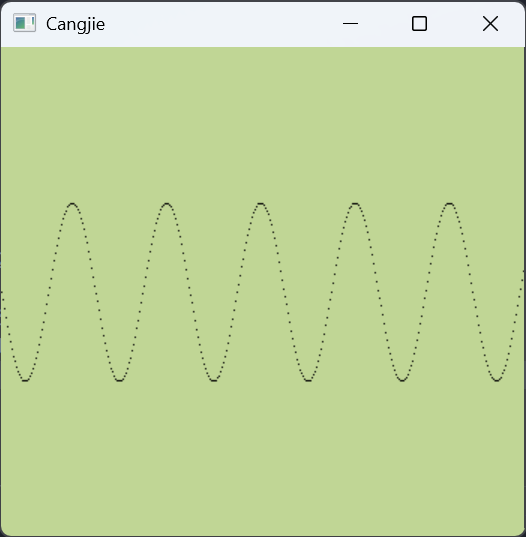

> [刘俊杰](https://www.bilibili.com/video/BV1gA2mYgEBj/)是华为仓颉编译与运行时团队的核心成员，曾参与仓颉编译器和运行时的设计与开发，目前主要负责仓颉的生态建设。以下内容为其发言概要。

不知道大家是否听说过，中国早期有一家做手机的公司叫做波导。那时候华为甚至还没开始做手机。波导公司的创始人及总工程师赵建东先生今天也来到了现场。

赵总之所以来到这里，是因为他认为中国自主研发编程语言这件事情非常有价值和意义。赵老师现在也是一家芯片公司——[视芯科技](https://www.ledsic.com.cn/)的老板。他平时并未停歇，还在业余时间开发了自己的编程语言，叫做 Fine 语言。赵老师认为做这件事的长期价值在于，通过我们未来的努力，去打破西方在一些核心技术上的垄断，培养我们自己的人才，同时这对大家未来的工作发展也非常有帮助。他怀着一种公益的心态来做这次分享，也想借此机会鼓励同学们，因为大家未来都可能成为非常优秀的工程师和创业者。

## 赵建东自述

> 按东南商报 2005 年 8 月 13 日文《[宁波科教界授最高奖 4位科教精英每人重奖60万元](https://zjnews.zjol.com.cn/system/2005/08/13/006269252.shtml)》：
>
> 赵建东，男，1965 年出生，高级工程师。1990 年毕业于兰州大学，获理学硕士学位；1991 年出任清华大学访问学者；1992 年任美国协和集团顺霸研究院(珠海)射频室主任；1992年底至今先后任宁波波导公司研发部经理、波导研究院院长、副总工程师、总工程师。
>
> 赵建东是波导公司创始人之一。作为公司技术负责人，多年来一直在科研一线从事技术开发工作，并带领公司科技人员积极研究新技术，开发新产品。先后开发了中文F系列、数字K系列寻呼机和800系列、900系列、S系列GSM、C系列CDMA手机，其中指纹识别智能手机是国内首创开发的。
>
> 以下内容为赵建东自述概要。

我从 1983 年进入兰州大学学习物理学，毕业后保送本校研究生，毕业论文是量子光学方面双光子激光器。1990
年毕业后，进入军工研究所，主要从事轰炸雷达、制导雷达等相关的研发工作，并曾与清华大学电子工程系合作开发项目。

到了 90 年代初，我被师兄说动，下海去了珠海一家美国投资的企业。后来，我创办了[波导](https://zh.wikipedia.org/wiki/%E6%B3%A2%E5%AF%BC_(%E5%85%AC%E5%8F%B8))公司。大家可能对「波导手机，手机中的战斗机」这句广告词还有印象，那是我们那个时代的产品。

在波导期间，大约是 2005 年左右，我们实际上做了两年手机操作系统。我们还和浙江大学计算机学院联合主办了全国性的手机软件大赛，每年吸引很多团队到杭州参赛，我们会收购前十名的团队或作品，并给予奖金。当时，我们就在探索手机软件的下载和安装模式。那时的网络环境还很差，通过 WAP 下载一个几百K的软件需要很长时间，流量费也很高，几乎不可用。后来 [GPRS](https://zh.wikipedia.org/zh-cn/GPRS) 出现，速度提升到 100-200 Kbps，情况才有所好转。

那段时期，国产手机经历了激烈的竞争，我们算是最后退出的那一批。之后，我又和朋友创办了现在的世芯科技，主要做芯片设计。我想强调的是，我们过去很多技术是跟随性的，缺乏底层创新。芯片设计行业毛利率能达到 35-40%，这是一个创新驱动的领域。因为对操作系统和编程语言的持续兴趣，我了解到华为正在做的仓颉语言和鸿蒙操作系统。我认为这两项工作具有开创性，可能会改变我们国家信息产业未来的发展方向。这也是我今天来到这里的原因。

在过去十几年的时间里，我自己也断断续续地开发了一个类似 C# 的编程语言，叫做 [Fine](http://www.finelanguage.com.cn/)，目前已经比较系统化了，它内置了 GUI、数据库和网络通讯等功能，是一个集成化的开发环境。

我的业余时间主要有两个爱好，打弹弓和写代码。很少参加此类活动，今天主要是来和大家简单交流一下。

## 技术与生态现状汇报

> 这一部分的 slides 可以查看[可画（canva.cn）](https://www.canva.cn/design/DAGNPiBf-Xo/glKe3MpHwQG4Ij_QZCgY8g/)。

首先，我们简单回顾一下编程语言的发展历史。最早的 C 语言诞生于上世纪70年代，当时计算机硬件资源有限，C 语言凭借其高效、灵活和贴近硬件的特点，迅速成为开发操作系统、编译器等系统软件的首选。

80年代，C++ 在 C 的基础上引入了面向对象编程，就像从用砖块盖房子，变成了用预制好的门、窗、屋顶等模块来组装，极大地提升了大型程序的开发效率和可维护性。

90年代，Java 和 Python 等语言崭露头角。Java 以其「一次编写，到处运行」的跨平台特性，在企业级应用和安卓开发中非常流行，目前大部分安卓应用仍是Java开发的。Python则因其语法简洁、库丰富，在数据科学和人工智能领域得到了广泛应用。

进入21世纪后，Go、Rust、Swift、Kotlin 等现代编程语言相继出现，它们通常用于云计算、分布式系统等领域，在并发处理、工具链等方面相较于之前的语言有了很大进步。

那么，在当前智能化、万物互联的时代背景下，下一代编程语言应该具备哪些特性呢？华为研发的仓颉语言，正是面向下一代编程语言进行探索，在智能化、高效率、安全可信以及易扩展等方面做了深入研究。

回顾仓颉的发展历程，项目于 2019 年启动，2020 年正式命名为「仓颉」，寓意着像仓颉造字一样，希望这门语言能被广大开发者喜爱并广泛使用。2022 年，仓颉语言首次在华为自研的 HarmonyOS 路由器上首次商用，替换原有的 Go 模块（仓颉在并发策略上参考的 Go 语言）。由，因此在首次商用中表现亮眼，性能有显著提升。

2023年，仓颉语言开始与国内多家头部企业展开深入合作，例如与中航、国家电网等在一些重要场景进行商业验证。整个研发过程中，国家也给予了大力支持。编程语言作为软件产业的根技术，研发自主可控的仓颉语言，有助于我们在核心技术上掌握主动权，尤其是在当前日益严峻的国际形势和科技竞争背景下，可以防范未来可能出现的「卡脖子」风险。

除了战略层面的考量，仓颉语言也是构建鸿蒙生态的重要一环。就像苹果的 Swift/Objective-C 支撑了 iOS 生态，谷歌的 Kotlin/Java 支撑了 Android 生态一样，鸿蒙作为国产操作系统，也需要有自己的原生开发语言来构建繁荣的生态。

2024 年是仓颉语言发展的重要一年，工商银行和力扣发布了使用仓颉编写的原生鸿蒙应用。其中，有道的应用是完全使用仓颉从零开始编写的，这证明了仓颉语言目前已经具备了开发完整应用的能力。在 6 月的华为开发者大会（HDC）上，仓颉语言将正式对外发布，届时开发者可以通过IDE插件等方式来使用仓颉语言。

接下来，介绍一下仓颉语言的主要技术特性，可以概括为智能化、全场景、高性能和强安全。

在性能方面，与目前安卓开发主流的 Java 语言相比，仓颉具有先天优势。仓颉是 AOT
到原生机器码的，相比 Java 需要通过虚拟机解释或 JIT，减少了运行时的翻译开销，因此执行速度更快。

传统的编译器，如 GCC、Clang
等，通常采用一体化设计，从预处理、词法分析、语法分析、语义分析到最终代码生成，整个流程是耦合在一起的。这种方式的局限性在于，为不同语言开发编译器都需要从头构建整个系统。仓颉的编译器架构是基于
LLVM 的模块化设计。它将编译过程划分为前端、IR 和后端。前端负责将不同语言的源代码转换成统一的中间表示（IR），类似于将各种食材加工成半成品。中端
IR 层是核心，它是一种与具体语言和目标机器无关的表示形式，可以在这个层面上进行各种通用的优化。后端则负责将优化后的 IR
生成特定目标机器的机器码。理论上，IR 到机器码的后端部分可以直接复用开源的 LLVM。不过，由于仓颉语言有一些独特的设计，比如参考了 Go 的协程，以及
Actor 并发模型，以及它的一些内建类型和内存管理特性，我们需要对 LLVM
的某些部分进行改造和扩展来适配这些需求（CJNative LLVM）。

在垃圾回收方面，仓颉采用了全并发分代垃圾回收机制。相比于传统的标记-清除算法可能导致的长时间 stop-the-world，分代 GC 能更有效地管理内存，减少 GC 停顿时间，从而降低应用程序的卡顿感，提升用户体验。鸿蒙原生 Markdown 组件（仓颉实现）渲染效果优于安卓版（Kotlin），且不掉帧。在 IO 密集型场景（如网络请求加载图片）下，仓颉的协程能够充分发挥优势，避免线程阻塞，提高吞吐量和响应速度。（[仓颉与 ArkTS 对比视频](https://www.canva.cn/design/DAGNPiBf-Xo/glKe3MpHwQG4Ij_QZCgY8g/view#8)）和 ArkTS 的对比测试中，使用仓颉实现的版本在启动速度和滑动流畅度上均优于 ArkTS 版本。

仓颉语言的另一个重要特性是「天生全场景」，在运行态是指有轻量对象布局、轻量运行时库、轻量用户线程、轻量回栈的特性。

天生全场景另一方面在于语言层面。由于技术变化，通过语法扩展，仓颉可以更好地适应各种新的硬件或软件架构。以及不同的领域对于不同的需求是不一样的。一个简单的例子是，通过给变量增加一个类似
`@state{:cj}` 的修饰符，就可以让这个变量具有响应状态变化的能力。当它的值改变时，自动触发
UI 更新，而不需要编写额外的监听或回调代码。

仓颉语言还积极拥抱 AI Agent（智能体）开发。使用 AgentDSL，开发者可以借助操作符，用非常简洁、接近自然语言的方式来与智能体的对话，而无需编写大量复杂的底层代码。

在安全性方面，仓颉也做了很多设计，例如编译期空安全检查、默认数据不可变性、数组越界检查等等。这些特性旨在减少开发过程中的常见错误，提高代码的健壮性和安全性。仓颉语言及其运行时已经获得了业界权威的安全认证。

如果大家想学习和了解仓颉，可以通过以下途径获取资源。仓颉项目目前主要托管在 Gitcode 平台，包括编译器、标准库、文档以及第三方库等。官方网站也提供了丰富的学习资料和开发者社区入口。我们非常欢迎同学们未来能参与到仓颉的开源社区中，贡献代码和应用案例。

:h2[从 PL 领域看仓颉]{id='PL'}

import FloatingImg from "@/components/FloatingImg.astro"

<FloatingImg src="https://remnote-user-data.s3.amazonaws.com/2IWBXpw72pqdoBKO1yI54ETlWITwVHLQ-nmKzJ7SdtCH-dXYNedIHjweXMAZkJZIC_w658obWUVtABAqPmkGB8i2I0tT8xsqBbsUkTejTpCjWQE1h4l3o_pmIGE_giuk.webp" alt='仓颉' width='256' height='256'>{/* PL 已经崛起了，这人没收到通知吗？ */}</FloatingImg>

刚刚提到了很多仓颉的特性，从编程语言（PL）领域的角度来看，语言设计是一个核心话题。国内高校很多课程侧重于编译器实现，这是一个偏工程的领域，但也涉及到一些理论，比如形式语言、自动机理论等。今天我尝试从另一个维度，即领域特定语言（DSL）的视角，来通俗地解读一下语言设计的一些趋势，以及仓颉在这方面的考虑。

编程语言的发展，从机器语言、汇编语言到高级语言，本质上是一个抽象层次不断提高的过程。抽象层次越高，语言表达能力越强，越接近人类自然语言，开发效率通常也越高。但代价是可能损失一些底层的控制力和性能，同时，构建更高层次抽象所需的技术和时间成本也可能更高。

当通用编程语言用于解决特定领域的问题时，往往需要编写很多与领域核心逻辑无关的「模板代码」或「胶水代码」。为了提高特定领域的开发效率和表达力，就产生了 DSL。DSL 是专门为某个特定领域设计的语言，它的语法和语义都紧密围绕该领域的需求。例如，SQL是数据库查询的DSL，HTML 是网页结构的 DSL。DSL 的优点是在其适用领域内非常高效、简洁、易于理解和维护，但缺点是通用性差，无法用于其设计领域之外的问题。

业界实践中，我们观察到一种趋势：在各种领域，都存在对DSL的需求。

1.  **数据库交互**：早期使用 JDBC 等 API，需要手动编写连接管理、SQL
语句构造、结果集映射等大量代码。后来出现了 ORM 框架，通过注解提供了一种
DSL。开发者只需在代码实体类和成员变量上添加注解，就能描述程序实体与数据库表、字段之间的映射关系，框架会自动处理底层的数据库操作。这种基于注解的
DSL，相比于纯 Java 代码，极大地简化了数据持久化操作。
2.  **进程间通信**：传统的 IPC
方式需要开发者处理复杂的序列化、反序列化、协议定义、连接管理等细节。后来出现了像
Android 的 AIDL（[Android Interface Definition Language](https://developer.android.com/develop/background-work/services/aidl)）这样的
IDL（接口定义语言）。开发者使用 AIDL 这种 DSL 来定义接口，工具链会自动生成底层的 IPC
代码。但这样只能通过在 Java 的基础上外挂实现，而非语言本身。
3.  **UI 开发**：传统的 UI 开发（如早期使用 C++ 的 MFC 或 Qt）需要编写大量命令式代码来创建、布局、设置样式和处理事件，UI
结构、样式和逻辑代码常常混杂在一起。后来发展出声明式 UI 框架，如 XML 布局，以及现代的 SwiftUI
等。这些框架提供了一种 DSL，让开发者能够更直观地描述 UI
的最终状态和结构，框架负责渲染和状态管理，屏蔽了无关的底层细节，显著提高了代码的可读性和定制化能力。
4.  **互操作**：例如 JS 调用 C 时需要去写 NAPI，需要调系统接口，做各种类型转换、异常处理。现代框架通常使用注解或更简洁的语法。相比复杂的 JNI/JNA，一些现代语言提供了更简洁的 FFI 机制。

总结这些案例，我们可以看到 DSL 在提升特定领域开发效率上的巨大价值。仓颉语言针对这种趋势，主要通过两种方式来支持 DSL：

1.  **原生集成**：对于一些非常通用且重要的领域，仓颉在语言层面直接内建了相应的语法和语义支持。这可以看作是一种高度优化的、内建的 DSL。
    - 在 C 语言互操作方面，仓颉通过声明式的语法，允许开发者以类似本地函数调用的方式直接声明和使用C函数。调用一个 C 函数只需一行声明，极大地简化了开发流程。
    - 在并发方面，传统语言通常通过调用第三方库或标准库实现并发，缺乏语言层面的支持。而仓颉参考了 Go 语言的协程框架，将并发机制内置于语言中，通过关键词 `spawn{:cj}` 实现轻量级线程的自动管理和调度。
2.  **扩展机制**：对于像数据库、化工这些不那么通用，或者需要高度定制化的领域，仓颉提供了语言和编译器的扩展机制。开发者可以通过宏或其他语法扩展方式，在仓颉语言内部定义新的语法结构，实现所谓的
EDSL，即「嵌入式 DSL」。这种方式的好处是，开发者不需要编写独立的编译器或解析器，可以直接利用仓颉的基础设施进行扩展，并且扩展后的 DSL 可以与仓颉代码无缝集成。这与像 Android 在 Java 外挂插件实现 DSL 的方式有所不同。

所以，从 DSL 的视角来看，仓颉的设计哲学是在通用层面提供强大的基础能力和内建 DSL 支持，同时赋予开发者通过 EDSL 机制为特定领域量身定制高效表达方式的能力。这种设计不仅满足了现代软件开发对领域专用表达的诉求，也体现了仓颉作为下一代编程语言的前瞻性，在实际应用中展现了显著优势。有一个国产适配项目需要迁移 4000 多个 C 接口，仓颉通过声明式的互操作机制，将这一过程简化为简单的函数声明，大幅提高了迁移效率。Agent DSL为智能体开发提供了简洁的表达方式，开发者可以通过接近自然语言的语法描述智能体行为，无需深入编写复杂逻辑，从而进一步降低了开发门槛。

## 动手实践环节

### 第一个实践题目：并发与系统调用

这个题目与我们刚刚讨论的并发和系统调用（特别是 FFI）有关。程序运行后会弹出一个空白的 Windows 窗口。代码内部已经使用仓颉调用 GDI 注册了窗口类、创建了窗口，并处理了消息循环，画图的基础框架已经搭好。

任务：在这个窗口里画出一条正弦曲线。具体来说，你需要找到代码中预留的位置，添加几行仓颉代码，调用 Windows 的 `SetPixel` 函数来绘制点。`SetPixel` 函数的原型可以在微软的 MSDN 文档中查到，或者参考代码中已有的其他 API 调用示例。你需要关注它的参数：第一个是设备上下文句柄（hDC），可以模仿现有代码获取；后面两个是 $x$、$y$ 坐标（整型）；最后一个是颜色值（COLORREF，也是一个整型）。

import Canvas from "./_Canvas"

<Canvas client:only="react" />

你需要编写一个循环，计算 $x$ 对应的 $y$ 值，注意可能需要进行类型转换（比如从浮点数转为整型），然后调用 `SetPixel` 在窗口的对应位置画点。代码中已经导入了所需的 Windows API 函数，可以直接调用。仓颉调用 C 函数时，通常需要将调用代码放在一个用 `@ccall{:cj}` 修饰的代码块中，这是一种语法标记，提示开发者这里可能涉及不安全的内存操作，并指导编译器进行一些检查。

最终完成的代码量大概只需要几行。这个练习旨在让大家体验仓颉 FFI 简洁性以及基本的编程。

---

查 M$ 文档：

```cpp
COLORREF SetPixel(
  [in] HDC      hdc,
  [in] int      x,
  [in] int      y,
  [in] COLORREF color
);
```

写出：

```cj title="src/api.cj" diff
  foreign func BeginPaint(hWnd: Handle, ps: CPointer<PAINTSTRUCT>): Handle
  foreign func EndPaint(hWnd: Handle, ps: CPointer<PAINTSTRUCT>): Bool
  foreign func GetClientRect(hWnd: Handle, rc: CPointer<RECT>): Bool
  foreign func Ellipse(hDC: Handle, left: Int32, top: Int32,
      right: Int32, bottom: Int32): Bool
  // 提示1：在这里声明绘图所需的 SetPixel 函数原型
+ foreign func SetPixel(hDC: Handle, x: Int32, y: Int32, color: UInt32): UInt32
```

这个文件里面还有些下面会用到的定义：
```cj
@C
struct POINT {
    public var x: Int32 = 0
    public var y: Int32 = 0
}

@C
struct RECT {
    public var left: Int32 = 0
    public var top: Int32 = 0
    public var right: Int32 = 0
    public var bottom: Int32 = 0
}

@C
struct PAINTSTRUCT {
  public var hDC: Handle = NULL
  public var fErase = true
  public var rcPaint = RECT()
  // 以下字段保留，系统在内部使用
  public var fRestore = false
  public var fIncUpdate = false
  public var rgbReserved = VArray<Byte, $32> { _ => 0 }
}
```


```cj title="src/main.cj"
// 基于 CFFI 的 Windows GUI 编程
package windows
import std.math.sin // 导入标准库中的 sin 数学函数

unsafe main() {
    let instance = GetModuleHandleA(EMPTY_STRING)
    // 注册窗口类
    let className = LibC.mallocCString('Cangjie Window')
    var windowClass = WNDCLASSEX(lpszClassName: className,
        hInstance: instance,
        lpfnWndProc: onMessage,
        hbrBackground: CreateSolidBrush(0x0095D6C0) // 中国传统色 欧碧
    )
    if (RegisterClassExA(inout windowClass) == 0) {
        println('RegisterClass Failed: ${GetLastError()}')
        return
    }
    // 创建窗口实例
    let windowName = LibC.mallocCString('Cangjie')
    let window = CreateWindowExA(
        0,                                   // 扩展样式
        className,                           // 窗口类名
        windowName,                          // 窗口标题
        WS_OVERLAPPEDWINDOW,                 // 窗口风格
        CW_USEDEFAULT, CW_USEDEFAULT,        // 窗口位置
        365, 365,                            // 窗口大小
        NULL,                                // 父窗口句柄
        NULL,                                // 菜单句柄
        instance,                            // 实例句柄
        NULL                                 // 附加参数
    )
    if (window.isNull()) {
        println('CreateWindow Failed: ${GetLastError()}')
        return
    }
    // 显示窗口
    ShowWindow(window, SW_SHOWNORMAL)
    UpdateWindow(window)
    // 启动消息循环
    var message = MSG()
    while (GetMessageA(inout message, NULL, 0, 0)) {
        TranslateMessage(inout message)
        DispatchMessageA(inout message)
    }
    // 退出消息循环
    println('Out of Message Loop')
    LibC.free(className)
    LibC.free(windowName)
}

func paint(hWnd: Handle, draw: (hDC: Handle) -> Unit) {
    var ps = PAINTSTRUCT()
    let hDC = unsafe { BeginPaint(hWnd, inout ps) }
    draw(hDC)
    unsafe { EndPaint(hWnd, inout ps) }
}
```

`DefWindowProcA{:cs}` 是 Windows 提供的默认窗口过程，当窗口大小改变后，`DefWindowProcA{:cs}` 通常会使窗口的客户区无效，从而导致 Windows 发送 WM_PAINT 消息。此时获取 hDC 后使用一个循环（比如 `for` 循环）遍历窗口的宽度作为 $x$ 坐标。

```cj diff
  unsafe func process(hWnd: Handle, msg: UInt32,
          wParam: UInt64, lParam: UInt64) {
      var result = 0
      if (msg == WM_PAINT) {
          paint(hWnd) { hDC =>
              var rect = RECT()
              GetClientRect(hWnd, inout rect)
              // 提示2：在这里添加绘图代码，绘制正弦曲线 y = 60 * sin(0.1 * x)
+             for (x in rect.left..rect.right) {
+                 let y = 60.0 * sin(0.1 * Float64(x))
+                 SetPixel(hDC, x, Int32(y) + rect.bottom / 2, 0x000000)
+             }
          }
      } else if (msg == WM_KEYDOWN && wParam == UInt64(VK_ESCAPE)) {
          DestroyWindow(hWnd)
      } else if (msg == WM_DESTROY) {
          PostQuitMessage(0)
      } else {
          result = DefWindowProcA(hWnd, msg, wParam, lParam)
      }
      return result
  }
```

需要调整 $y$ 坐标使其适应窗口坐标系，例如，将原点移到窗口中央。



最后，在 `@ccall{:cj}` 块内调用 `SetPixel(hdc, x, y, color){:cj}`。

```cj
@C
@CallingConv[STDCALL]
func onMessage(hWnd: Handle, msg: UInt32,
        wParam: UInt64, lParam: UInt64): Int64 {
    unsafe { process(hWnd, msg, wParam, lParam) }
}
```

这里的 hDC 类型在仓颉中可能用一个别名（如 `Handle`）表示，它本质上是一个指针或整数。整型参数可以直接传递。颜色可以用 `RGB(r, g, b){:cj}` 宏（如果导入了）或者直接用整型。

### 第二个实践题目：仓颉智能体框架

仓颉的智能体框架 AgentDSL 的核心思想是将大型语言模型（LLM）的「说话」能力转化为「做事」能力。LLM 理解自然语言、知识和推理能力很强，可以规划任务步骤。我们只需要编写程序，提取 LLM 输出的文本中的意图和参数，然后调用实际的设备驱动或 API，就能让 LLM「指挥」程序执行任务。

业界已有一些框架（如 LangChain）通过 API 调用的方式实现类似功能。仓颉 AgentDSL 的特色在于它采用了「声明式」的方式。开发者不需要编写大量的接口调用和初始化代码，而是通过注解来定义智能体及其能力。

例如，在一个类上使用 `@Agent{:cj}` 注解，这个类就具备了与 LLM 交互的基础能力。你可以直接调用它的 `chat` 方法进行对话。如果在类中定义一些属性或方法，可以设定 Agent 的角色或初始状态。定义函数时可以用 `@Tool{:cj}` 注解修饰，包含两个参数：一个是描述这个工具（函数）能做什么，另一个是描述它的参数各自代表什么。

当用户与 Agent 交互时，框架会自动将这些 `@Tool` 的描述信息整合到发送给 LLM 的 prompt 中。LLM 在理解用户意图后，会决定调用哪个工具以及传递什么参数，并以特定格式返回给框架。框架解析LLM的回复，然后实际执行对应的函数调用。

**例子**：一个智能家居助手，通过 `@Agent` 定义助手，用 `@Tool` 定义控制灯光、空调等的函数。用户说「把客厅灯打开」，LLM理解后指示框架调用「开灯」函数，并附带参数「客厅」。

**任务**：使用 AgentDSL 来控制一个模拟的魔方。我们提供了一个基础的魔方程序（在控制台打印魔方的状态），它有一个 `Cube` 类，可以通过调用其成员函数（如 `turn(face, direction){:cj}`）来转动不同的面。参数 `face` 用字母表示（如 F, B, L, R, U, D），`direction` 表示顺时针或逆时针。

**期望**：运行程序后，在控制台输入指令，程序能正确解析并调用对应的魔方转动函数，并打印出转动后的魔方状态。

```cj diff
  package agent
  
  import magic.dsl.*
  import magic.prelude.*
  import magic.config.Config
  
  @agent[model: "ark:deepseek-v3-250324"]
  class CubeAgent {
      // 提示1: 调用 cube.transform('F', true) 可以将魔方正面逆时针旋转 90 度
      // 字母 F, B, L, R, U, D 分别表示魔方的前、后、左、右、上、下 6 个面
      let cube = Cube()

      @prompt(
          // 提示2: 在这里添加 Agent 提示词，让 AI 熟悉业务场景，例如它的职责和魔方各面的字符定义等
+         "你是一个魔方大师专家，负责控制魔方的旋转和输出魔方的展开图。\n魔方的各个面用字母表示：字母 F, B, L, R, U, D 分别表示魔方的前、后、左、右、上、下 6 个面"
      )

      @tool[description: "获取魔方当前状态下的展开图"]
      func now(): String {
          cube.toString()
      }

      // 提示3: 在下面添加两个 @tool 修饰的函数，让 AI 可以控制魔方的旋转
      // 两个函数分别控制顺时针和逆时针旋转，函数参数指定具体旋转哪个面
+     @tool[description: "顺时针旋转魔方的某个面"]
+     func rotate(face: String) {
+         cube.transform(face, false)
+     }
+
+     @tool[description: "逆时针旋转魔方的某个面"]
+     func rotateCounter(face: String) {
+         cube.transform(face, true)
+     }
  }

  main() {
      Config.env["ARK_API_KEY"] = "[redacted]"
      Config.maxReactNumber = 100
      let agent = CubeAgent()
      agent.chat("顺时针旋转正面 2 次，逆时针旋转顶面 1 次，输出魔方展开图") |> println
  }
```

根据演讲者，部分 LLM 对于一些布尔参数支持得不是很好，所以推荐写两个函数。

### 第三个实践题目：并发网络编程与 AI 结合

最后一个题目结合了网络编程、并发和AI。仓颉编写 TCP 通信和创建协程（用于处理并发连接或任务）的代码非常简洁。提供的代码支持多客户端连接一个服务端。服务端接收控制台输入，并将消息广播给所有连接的客户端。客户端接收控制台输入，并将消息发送给服务端。同时还提供了一个独立的仓颉模块（`llm.cj`），封装了与大语言模型聊天的功能。这个模块提供了一个类，可以创建实例并调用其 `chat` 方法（一次性获取回复）或 `stream_chat` 方法（流式获取回复）来进行对话。可直接运行这个模块体验与 AI 聊天。

**任务**：修改客户端和服务端程序，让它们不再接收控制台的用户输入，而是各自创建一个 LLM 实例，然后通过网络互相发送消息，实现两个 AI 自动聊天的效果。

**步骤**：
1. 在服务端和客户端的代码中，`import` 我们提供的 `llm.cj` 模块。
2. 在各自的程序初始化部分，创建LLM类的实例。可以给它们设定不同的角色（比如一个扮演贾宝玉，一个扮演林黛玉），通过初始化时的 prompt 来实现。
3. 修改网络消息处理逻辑：
   * 当客户端收到服务端的消息后，不再打印到控制台，而是将这个消息作为输入，调用自己的 LLM 实例的 `chat` 方法获取回复。然后将 LLM 的回复通过网络发送给服务端。
    * 当服务端收到客户端的消息后，同样调用自己的 LLM 实例获取回复，然后将回复通过网络发送回该客户端（或者广播给所有客户端，取决于你想要的效果）。
4. 需要一个启动机制，比如让客户端在连接成功后，主动发送第一句话（可以是一个固定的问候语，或者调用 LLM 生成一句开场白）给服务端，来触发对话的开始。
5. 编译时需要将 `llm.cj` 文件与客户端、服务端代码一起编译，因为它们现在互相依赖。运行命令可能需要指定主模块入口：
    ```bat title="build.bat"
    cjc client.cj llm.cj -o client.exe
    cjc server.cj llm.cj -o server.exe
    ```

**期望**：启动服务端和客户端后，它们能够通过TCP连接，自动地进行一轮又一轮的对话，并将对话内容打印在各自的控制台上（或者你可以选择不打印）。

这个题目的核心在于将原来处理标准输入输出的地方，替换成处理网络收到的消息和调用LLM获取回复。在客户端，收到网络消息后，`reply = llm.chat(received_message){:cj}`，然后 `socket.send(reply){:cj}`。在服务端，收到某个客户端的消息后，`reply = llm.chat(received_message){:cj}`，然后 `client_socket.send(reply){:cj}`。需要注意处理好异步接收和发送的逻辑，以及对话的启动。

```cj
package chat

import std.console.Console
import std.socket.*

func startInputListener(client: TcpSocket) {
    spawn { // 在新线程中接收控制台输入并发送到对端
        while (true) {
            // ...
        }
    }
}

main() {
    const IP = "127.0.0.1"
    const PORT: UInt16 = 23456
    const BUFFER_SIZE = 1024

    // 使用 SiliconFlow 提供的服务接口
    let robot = LLM(
        url: 'https://api.siliconflow.cn/v1/chat/completions',
        key: 'sk-[redacted]',
        model: 'Pro/deepseek-ai/DeepSeek-V3',
        memory: true
    )

    robot.preset([(System, '我会用林黛玉的风格回复哥哥的所有问题')])

    let client = TcpSocket(IP, PORT)
    client.connect() // 和服务端建立连接
    startInputListener(client)
    while (true) { // 在循环中不断接收服务端发来的消息并打印
        let data = Array<Byte>(BUFFER_SIZE, item: 0)
        client.read(data)
        println(String.fromUtf8(data))
        let res = robot.chat(String.fromUtf8(data))
        client.write(res.toArray())
    }
}
```

### 奖品


不过博主获得的是一个比较有崛起风格的Ｕ盘：


另外，反馈说仓颉的鸿蒙部分即将开源。
