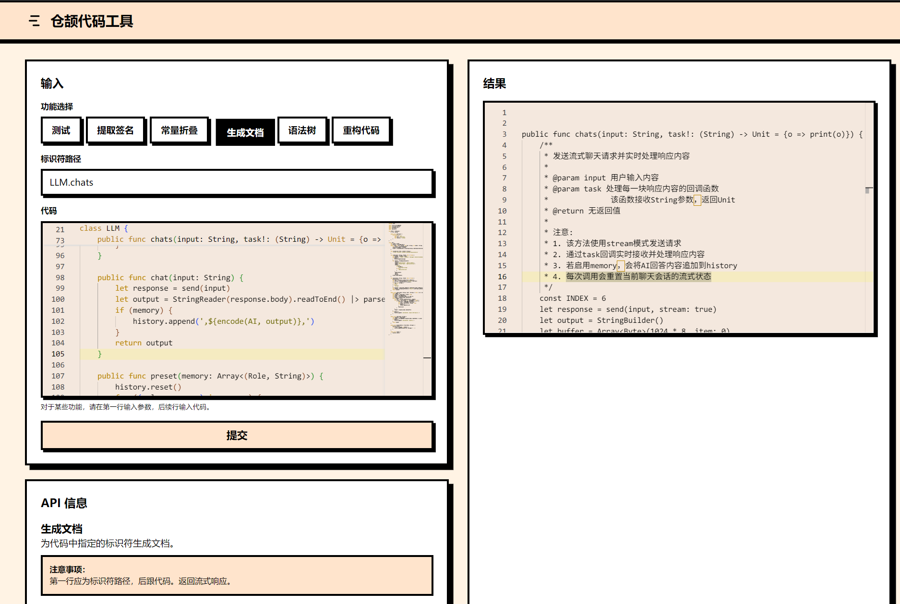
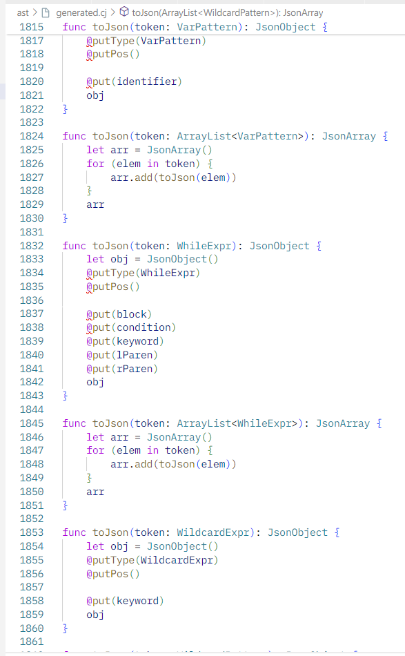
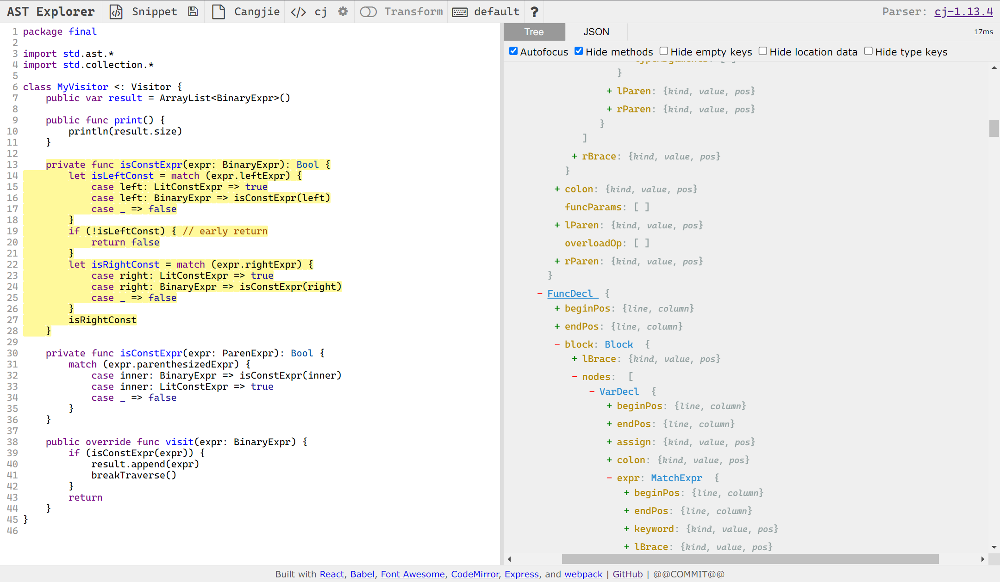

{/*  */}

## 前端

{/*  */}

前端部分使用 React 搭建界面。

### 代码高亮

采用了 Monaco 提供仓颉代码高亮。Monaco Editor 采用了一种名为 Monarch 的声明式词法规范。通过定义一系列正则表达式规则为词法单元分配特定的类型。

首先创建 `editor-config.js`，定义 `languageDef` 对象，包含 `keywords`、`typeKeywords`（类型相关的关键字）、`operators`（操作符）、`symbols`（符号的正则表达式）和 `escapes`（字符串中的转义字符规则）。最核心的部分是 `tokenizer`，它是一个状态机，通过定义一系列正则表达式规则，将代码片段赋予特定的词法类型。

在 `CodeInput.tsx` React 组件中，使用 `@monaco-editor/react` 包提供的 `Editor` 组件。在 `editorBeforeMount` 函数内部，调用 
`languages.register({ id: 'cangjie' }){:js}` 来注册新语言。然后用
`monaco.languages.setMonarchTokensProvider('cangjie', languageDef){:js}`
将之前定义的 Monarch 词法规则与 `'cangjie'` 语言 ID 关联起来，`monaco.languages.setLanguageConfiguration('cangjie', configuration){:js}` 将语言行为配置与 `'cangjie'` 语言 ID 关联。在 `Editor` 组件上设置 `defaultLanguage="cangjie"` 即可。

## HttpServer

### 主要踩的坑

`std.ast.cangjieLex(){:cj}`、`parseProgram` 甚至部分结构体的 `toTokens()`
都不是线程安全的。最好的办法是调用 `CJCodeTool` 类中的方法时 `spawn{:cj}`：

```cj
let output = spawn { CJCodeTool.generateDocument(...) }.get()
```

类似 Rust，仓颉支持尾语句作为块的返回值，所以写起来不算麻烦。

### CORS

现代浏览器在进行网络请求时，会遵循同源策略（Same-Origin Policy），不允许跨域请求，即对于
$(\text{协议, 域名, 端口})$ 这一三元组，如果两个请求的这一三元组不同，则不允许跨域请求。

因此，如果需要跨域请求，最好的方法是在服务器端设置 CORS 头。

```cj
func sendRes(httpContext: HttpContext, output: String) {
    let headers = HttpHeaders()
    // cors
    headers.add("Access-Control-Allow-Origin", "*")
    headers.add("Access-Control-Allow-Methods", "POST, GET")
    headers.add("Access-Control-Allow-Headers", "Content-Type")
    // 设置 content-type
    headers.add("Content-Type", "text/plain")
    httpContext.responseBuilder.addHeaders(headers).body(output)
}
```

## (a) `generateCodeSignature` 函数 

> 该函数的功能是生成代码文件的签名。此处的“签名”包含“函数签名”和“类（接口）签名”，具体到仓颉语言，可以理解为定义接口时使用的无实现成员函数。而类签名则包含了类的声明语句以及它内部成员（包括属性，变量，函数）的签
名。

### 实现步骤

1. 使用 `cangjieLex(code)` 将输入的代码字符串词法分析为 `Tokens`。
2. 使用 `parseProgram(tokens)` 将 `Tokens` 解析为抽象语法树（AST），根节点为 `Program` 类型。
3. 遍历 `program.decls` 中的顶层声明。通过模式匹配（`match` 表达式）区分 `FuncDecl`（函数声明）、`ClassDecl`（类声明）和 `InterfaceDecl`（接口声明）。
4. 对于 `FuncDecl`：直接提取其函数体起始花括号之前的所有 token。
5. 对于 `ClassDecl` 和 `InterfaceDecl`：提取其修饰符、`class`/`interface`关键字、名称、父接口/类序列（如果存在）。然后递归处理其内部成员（`VarDecl`、`PropDecl`、`FuncDecl`），提取这些成员的签名，并进行适当的缩进。类/接口的实现体被省略，仅保留签名的嵌套结构。
6. 实现中，通过获取声明节点的 `toTokens()`，然后有选择地拼接或替换部分 Token（例如，将类或函数体的 `{...}` 替换为仅包含成员签名的 `{...}`）来构造最终的签名字符串。
7. 输出时，确保每个签名之间有空行，缩进使用四个空格。这部分是根据序列化后的实现行为手动加入空行。
8. 若输入不符合数据限制（如顶层声明包含非函数、类、接口，或内部声明不符合要求），则返回 "ILLEGAL INPUT"。

### 模式匹配类型的语法

```cj {1-2} title="tool.cj" /case d: FuncDecl/#i /case d: ClassDecl/#i /case d: InterfaceDecl/#i "{"#s
class CJCodeTool {
    static func generateCodeSignature(code: String): String {
        let tokens = cangjieLex(code)
        // 任何一个仓颉源码文件都可以被解析为一个 Program 类型。
        let program = parseProgram(tokens)
        let sig = quote()
        for (decl in program.decls) {
            let result = match (decl) {
                case d: FuncDecl => genFuncSig(d)
                case d: ClassDecl => genClassSig(d)
                case d: InterfaceDecl => genInterfaceSig(d)
                case _ => throw Exception("Unexpected Decl")
            } |> sig.append
        }
        return trimTokensEnd(sig).toString()
    }
```

### 直接截断

对于 `genBlockSig` 和 `genBodySig` 函数，它们分别用于生成函数块和类/接口体的签名。`genBlockSig`
直接返回空的 `Tokens`，因为函数签名不需要包含函数体的实现细节。而 `genBodySig` 则需要递归处理类/接口体内的成员声明，保留其签名结构。

```cj /genBodySig/#v /classDecl.body/#v /interfaceDecl.body/#v /genBlockSig/#i /funcDecl.block/#i "{"#s {1} {7} {13}
public func genFuncSig(funcDecl: FuncDecl): Tokens {
    let tokens = funcDecl.toTokens()
    let blockSig = genBlockSig(funcDecl.block)
    return genSig(tokens, funcDecl.block.lBrace, funcDecl.block.rBrace, blockSig)
}

public func genClassSig(classDecl: ClassDecl): Tokens {
    let tokens = classDecl.toTokens()
    let bodySig = genBodySig(classDecl.body)
    return genSig(tokens, classDecl.body.lBrace, classDecl.body.rBrace, bodySig)
}

public func genInterfaceSig(interfaceDecl: InterfaceDecl): Tokens {
    let tokens = interfaceDecl.toTokens()
    let bodySig = genBodySig(interfaceDecl.body)
    return genSig(tokens, interfaceDecl.body.lBrace, interfaceDecl.body.rBrace, bodySig)
}
```

### 相等的条件：完全一致

仓颉中 `Token` 判断相等的条件是位置完全一致，所以不会出现仅仅是重复的 `Token`
就被认为是相等的情况。借助这个特性，我们可以通过 `lParen` 等特殊 token 来截取之前的部分。

```cj /token == lParen/#v /token == rParen/#s
func genSig(tokens: Tokens, lParen: Token, rParen: Token, innerSig: Tokens): Tokens {
    let sig = quote()
    var isInBlock = false
    for ((index, token) in enumerate(tokens)) {
        if (token == lParen) {
            sig.append(token)
            isInBlock = true
            sig.append(genNewLines(1))
            sig.append(innerSig)
        } else if (token == rParen) {
            sig.append(genNewLines(1))
            sig.append(token)
            isInBlock = false
        } else if (!isInBlock) {
            sig.append(token)
        }
    }
    sig.append(genNewLines(1))
}
```

### 测试用例

```cj title="输入"
interface I1 {
    mut prop size: Int64
}

class C <: I1 {
    private var mySize = 0

    public mut prop size: Int64 {
        get() {
            mySize
        }
        set(value) {
            mySize = value
        }
    }

    public func getSize() {
        mySize
    }
}

public func testC() {
    let a: I1 = C()
    a.size = 5
    if (a.size == 5) {
        println("Do nothing")
    } else {
        println("Do nothing")
    }
    println(a.size)
}
```

```cj title="输出"
interface I1 {
    mut prop size: Int64
}

class C <: I1 {
    private var mySize
    
    public mut prop size: Int64
    
    public func getSize()
}

public func testC() {
    
    
}
```

## (b) `refactorVariable` 函数

> 该函数的功能是通过path 参数指定代码中的一个类或者函数，然后将其作用域内的某个标识符（oldName）全部替换为另一个标识符（newName）。对于函数，
作用域是函数签名和函数体这个整体，对于类也完全类似。

### 实现步骤

1. 将输入代码 `code` 解析为 AST。
2. 解析 `path` 参数（如 "函数名", "类名", "类名.函数名"）以定位目标作用域。
3. 遍历 `program.decls` 找到路径的第一部分匹配的顶层声明（函数或类）。
4. 如果路径包含 "." (如 "类名.函数名")，则在找到的类声明内部继续查找匹配的函数名。
5. 一旦定位到目标作用域（`FuncDecl` 或 `ClassDecl` 节点），将其转换为 `Tokens`。
6. 遍历这些 `Tokens`，当遇到 `TokenKind.IDENTIFIER` 且其 `value` 等于 `oldName` 时，将其替换为一个新的 `Token`，其 `kind` 仍为 `TokenKind.IDENTIFIER`，但 `value` 为 `newName`。
7. 将修改后的 `Tokens` 重新组合成字符串。
8. 如果 `path` 在源代码中不存在或不符合数据限制，返回 "ILLEGAL INPUT"。

### 主要思想

由于作业要求中明确写了

> 词法单元之间的空格和换行规范不做要求（但要保证语法正确性），

因此可以直接修改语法树，然后再将语法树转换为词法单元。这样虽然会丢掉原来的空格和换行，但是比直接替换 tokens 要方便得多。

```cj
static func refactorVariable(code: String, path: String, oldName: String, newName: String): String {
    let tokens = cangjieLex(code)
    let program = parseProgram(tokens)
    let pathParts = path.split(".")
    for (i in 0..program.decls.size) {
        let decl = program.decls[i]
        if (decl.identifier.toTokens().toString() == pathParts[0]) {
            let replaced = refactorByPath(decl, path, oldName, newName)
            let newDecl = parseDecl(replaced)
            program.decls[i] = newDecl // 词法单元之间的空格和换行规范不做要求（但要保证语法正确性）
            return program.toTokens().toString()
        }
    }
    throw Exception("Variable not found")
}
```

其实应直接修改 AST 节点中的标识符，然后调用整个 `Program` 节点的 `toTokens().toString()` 生成新代码，但仓颉的 AST 各个节点类的字段都是不可变的。因此本实现在定位到具体节点后，对其 `toTokens()` 的结果进行操作，然后将这部分修改后的 tokens 插入回整体代码结构中。

### 一些假设

由于这些假设，我们可以直接遍历 `program.decls` 找到目标声明，然后直接对其 `toTokens()` 的结果进行替换：

1. 路径唯一且合法；
2. 作用域明确且无变量遮蔽，不考虑形参与内部变量冲突；
3. 不会重载函数；
4. 仅通过词法替换实现重构；
5. 被替换的 `oldName` 出现在语法树中 `toTokens()` 的结果中。

```cj /classDecl.body.decls/#v /classDecl.toTokens()/#s
public func refactorByPath(decl: Decl, path: String, oldName: String, newName: String): Tokens {
    var tokens = decl.toTokens()
    if (let Some(index) <- path.indexOf(".")) {
        let parts = path.split(".")
        let funcName = parts[1]
        let replaced = quote()
        let classDecl = (decl as ClassDecl).getOrThrow()
        let innerDecls = classDecl.body.decls
        for (i in 0..innerDecls.size) {
            let innerDecl = innerDecls[i]
            if (innerDecl.identifier.toTokens().toString() == funcName) {
                let replaced = refactorByPath(innerDecl, funcName, oldName, newName)
                let newDecl = parseDecl(replaced)
                classDecl.body.decls[i] = newDecl
                tokens = classDecl.toTokens()
                return tokens
            }
        }
        throw Exception("No method found")
    } else {
        let replaced = quote()
        for (token in tokens) {
            if (token.kind == TokenKind.IDENTIFIER && token.value == oldName) {
                replaced.append(Token(TokenKind.IDENTIFIER, newName))
            } else {
                replaced.append(token)
            }
        }
        replaced
    }
}
```

### 测试用例

重构参数：`testC,a,b`

代码输入：
```cj
public func testC() {
    let a: I1 = C()
    a.size = 5
    if (a.size == 5) {
        println("Do nothing")
    } else {
        println("Do nothing")
    }
    println(a.size)
}
```

输出：
```cj
public func testC() {
    let b: I1 = C()
    b.size = 5
    if(b.size == 5) {
        println("Do nothing")
    }
    else {
        println("Do nothing")
    }
    println(b.size)
}
```

测试用例：`DocumentReq.deserialize,dms,dataModels`

```cj
class DocumentReq <: Serializable<DocumentReq> {
    var code: String = ""
    var path: String = ""

    public DocumentReq(code: String, path: String) {
        this.code = code
        this.path = path
    }

    public func serialize(): DataModel {
        return DataModelStruct().add(field<String>("code", code)).add(field<String>("path", path))
    }

    public static func deserialize(dm: DataModel): DocumentReq {
        var dms = match (dm) {
            case data: DataModelStruct => data
            case _ => throw Exception("this data is not DataModelStruct for DocumentReq")
        }
        let code = String.deserialize(dms.get("code"))
        let path = String.deserialize(dms.get("path"))
        DocumentReq(code, path)
    }
}
```

```cj
class DocumentReq <: Serializable < DocumentReq > {
    var code: String = ""
    var path: String = ""
    public DocumentReq(code: String, path: String) {
        this.code = code
        this.path = path
    }
    public func serialize(): DataModel {
        return DataModelStruct().add(field < String >("code", code)).add(field < String >("path", path))
    }
    public static func deserialize(dm: DataModel): DocumentReq {
        var dataModels = match(dm) {
            case data: DataModelStruct => data
            case _ => throw Exception("this data is not DataModelStruct for DocumentReq")
        }
        let code = String.deserialize(dataModels.get("code"))
        let path = String.deserialize(dataModels.get("path"))
        DocumentReq(code, path)
    }
}
```

## (c) `generateDocument` 函数

> 该函数的功能是通过path 参数指定代码中的一个类或者函数，然后为其生成解释文档（以块注释的形式展示），用于解释该类或者函数的功能。

### 实现步骤

1.  初始化 LLM 类，配置了 API 地址、从 `.key.txt` 文件读取的密钥、使用的模型名称（如 `Qwen/Qwen3-8B`）以及启用记忆功能；
2.  为 LLM 设置了一个系统级指令；
3.  构建一个发送给 LLM 的具体提示词（prompt），包含指令以及用户提供的完整代码；
4.  将此提示发送给 LLM 进行处理，并获取 LLM 返回的结果。由于采用 8B 模型，所以没有使用流式对话。

### 测试用例

{/*  */}

```cj title="输入"
package final

import std.io.StringReader
import std.time.Duration
import encoding.json.*
import net.http.*
import net.tls.*

enum Role <: ToString {
    I | AI | System

    public func toString() {
        match (this) {
            case I => 'user'
            case AI => 'assistant'
            case System => 'system'
        }
    }
}

class LLM {
    let client: Client
    let history = StringBuilder()
    public LLM(let url!: String, let key!: String, let model!: String, let memory!: Bool = false) {
        var config = TlsClientConfig()
        config.verifyMode = TrustAll
        client = ClientBuilder().tlsConfig(config).readTimeout(Duration.Max).build()
    }

    func encode(role: Role, content: String) {
        '{"role":"${role}","content":${JsonString(content)}}'
    }

    func send(input: String, stream!: Bool = false) {
        let message = encode(I, input)
        let content = '{"model":"${model}","messages":[${history}${message}],"stream":${stream}}'
        if (memory) {
            history.append(message)
        }
        let request = HttpRequestBuilder()
            .url(url)
            .header('Authorization', 'Bearer ${key}')
            .header('Content-Type', 'application/json')
            .header(
                'Accept',
                if (stream) {
                    'text/event-stream'
                } else {
                    'application/json'
                }
            )
            .body(content)
            .post()
            .build()
        client.send(request)
    }

    func parse(text: String, stream!: Bool = false) {
        println(text)
        let json = JsonValue.fromStr(text).asObject()
        let choices = json.getFields()['choices'].asArray()
        // 流式和非流式情况下，这个字段名称不同
        let key = if (stream) {
            'delta'
        } else {
            'message'
        }
        let message = choices[0].asObject().getFields()[key].asObject()
        let content = message.getFields()['content'].asString().getValue()
        return content
    }

    public func chats(input: String, task!: (String) -> Unit = {o => print(o)}) {
        const INDEX = 6
        let response = send(input, stream: true)
        let output = StringBuilder()
        let buffer = Array<Byte>(1024 * 8, item: 0)
        var length = response.body.read(buffer)
        while (length != 0) {
            let text = String.fromUtf8(buffer[..length])
            for (line in text.split('\n', removeEmpty: true)) {
                if (line.size > INDEX && line[INDEX] == b'{') {
                    let json = line[INDEX..line.size]
                    let slice = parse(json, stream: true)
                    if (memory) {
                        output.append(slice)
                    }
                    task(slice)
                }
            }
            length = response.body.read(buffer)
        }
        if (memory) {
            history.append(',${encode(AI, output.toString())},')
        }
    }

    public func chat(input: String) {
        let response = send(input)
        let output = StringReader(response.body).readToEnd() |> parse
        if (memory) {
            history.append(',${encode(AI, output)},')
        }
        return output
    }

    public func preset(memory: Array<(Role, String)>) {
        history.reset()
        for ((role, message) in memory) {
            history.append(encode(role, message) + ',')
        }
    }

    public func reset() {
        history.reset()
    }
}
```

```cj title="输出"
public func chats(input: String, task!: (String) -> Unit = {o => print(o)}) {
    /**
     * 发送流式聊天请求并实时处理响应内容
     * 
     * @param input 用户输入内容
     * @param task 处理每一块响应内容的回调函数
     *              该函数接收String参数，返回Unit
     * @return 无返回值
     * 
     * 注意:
     * 1. 该方法使用stream模式发送请求
     * 2. 通过task回调实时接收并处理响应内容
     * 3. 若启用memory，会将AI回答内容追加到history
     * 4. 每次调用会重置当前聊天会话的流式状态
     */
    const INDEX = 6
    let response = send(input, stream: true)
    let output = StringBuilder()
    let buffer = Array<Byte>(1024 * 8, item: 0)
    var length = response.body.read(buffer)
    while (length != 0) {
        let text = String.fromUtf8(buffer[..length])
        for (line in text.split('\n', removeEmpty: true)) {
            if (line.size > INDEX && line[INDEX] == b'{') {
                let json = line[INDEX..line.size]
                let slice = parse(json, stream: true)
                if (memory) {
                    output.append(slice)
                }
                task(slice)
            }
        }
        length = response.body.read(buffer)
    }
    if (memory) {
        history.append(',${encode(AI, output.toString())},')
    }
}
```

## (d) `foldConstant` 函数

> 该函数的功能是将代码中可直接计算的常量进行折叠，不考虑常量传播。例如，如果代码中存在一句 `let a = 3 + 2`，则折叠之后这句代码就变为 `let a = 5`。

---

### 使用 `visitor` 访问节点

仓颉的 `Visitor{:cj}` 类体现了重载的方便之处：只需要实现想要处理的类型的函数实现即可。

```cj /override/#s /result/#v /func isConstExpr(expr: /#i /parenthesizedExpr/#s

class MyVisitor <: Visitor {
    public var result = ArrayList<BinaryExpr>()

    private func isConstExpr(expr: BinaryExpr): Bool {
        let isLeftConst = match (expr.leftExpr) {
            case left: LitConstExpr => true
            case left: BinaryExpr => isConstExpr(left)
            case left: ParenExpr => isConstExpr(left)
            case left: UnaryExpr => isConstExpr(left)
            case _ => false
        }
        if (!isLeftConst) { // early return
            return false
        }
        let isRightConst = match (expr.rightExpr) {
            case right: LitConstExpr => true
            case right: BinaryExpr => isConstExpr(right)
            case right: ParenExpr => isConstExpr(right)
            case right: UnaryExpr => isConstExpr(right)
            case _ => false
        }
        isRightConst
    }

    private func isConstExpr(expr: UnaryExpr): Bool {
        match (expr.op) {
            ...
        }
    }

    private func isConstExpr(expr: ParenExpr): Bool {
        match (expr.parenthesizedExpr) {
            case inner: BinaryExpr => isConstExpr(inner)
            case inner: LitConstExpr => true
            case inner: ParenExpr => isConstExpr(inner)
            case inner: UnaryExpr => isConstExpr(inner)
            case _ => false
        }
    }

    public override func visit(expr: BinaryExpr) {
        if (isConstExpr(expr)) {
            result.append(expr)
            breakTraverse() // 不会继续遍历子节点
        }
        return
    }
}

...
let program = parseProgram(tokens)
program.traverse(visitor)
```
- 解析为 AST（抽象语法树）后，使用 `visitor` 访问节点
- 定位所有 `BinaryExpr`，确保只处理结构合法且可折叠的目标
- 终止的条件是 `BinaryExpr` 递归到所有子节点没有变量等标识符
- 仓颉不支持边访问边替换，将结果收集起来

### 处理不同数值类型
```cj /enum ConstLit/#s
enum ConstLit <: ToString {
    Float(Float64) | Int(BigInt)

    public func toToken(): Token { ... }
    ...
}
...
    match ((left, right)) {
      case (ConstLit.Float, ConstLit.Float) => ...
      case (ConstLit.Int, ConstLit.Int) => ...
    }
```
- 整数和浮点数分别使用 `BigInt` 和 `Float64` 类型，避免精度丢失或类型错误。
- 用 `ConstLit` 枚举包裹值类型，统一抽象、便于扩展。

### 递归计算收集的常量表达式
```cj /func calculateExpr/#i /calculateExpr/#s
private func calculateLit(left: ConstLit, op: Token, right: ConstLit): ConstLit {
    match ((left, right)) {
        case (ConstLit.Float(left), ConstLit.Float(right)) => ConstLit.Float(calculateFloat(left, op, right))
        case (ConstLit.Int(left), ConstLit.Int(right)) => ConstLit.Int(calculateInteger(left, op, right))
        case _ => throw Exception("Unexpected ConstLit")
    }
}

private func calculateExpr(expr: LitConstExpr): ConstLit {
    let token = expr.toTokens()[0]
    match (token.kind) {
        case TokenKind.FLOAT_LITERAL => ConstLit.Float(Float64.parse(token.value))
        case TokenKind.INTEGER_LITERAL => ConstLit.Int(BigInt(token.value))
        case _ => throw Exception("Unexpected ConstLit")
    }
}

private func calculateExpr(expr: Expr): ConstLit {
    match (expr) {
        case expr: LitConstExpr => calculateExpr(expr)
        case expr: BinaryExpr => calculateExpr(expr)
        case _ => throw Exception("Unexpected Expr")
    }
}

private func calculateExpr(expr: BinaryExpr): ConstLit {
    let left = calculateExpr(expr.leftExpr)
    let right = calculateExpr(expr.rightExpr)
    calculateLit(left, expr.op, right)
}
```

### 在原始 token 流中直接定位并替换

Tokens 类不是 Array，缺少很多功能

```swift
let startIndex = findTokenIndex(tokens, left)
let endIndex = findTokenIndex(tokens, right)
newTokens = replaceTokensByRange(newTokens, startIndex..endIndex, foldedToken)
```

通过逆序处理避免 token 替换错位：
```cj
public func comparePos(a: Position, b: Position): Ordering {
    match (a.line.compare(b.line)) {
        case Ordering.EQ => a.column.compare(b.column)
        case notEq => notEq
    }
}
...
exprs.sortBy(stable: false) {
  b: BinaryExpr, a: BinaryExpr => comparePos(a.beginPos, b.beginPos)
}
```

### 测试用例

```cj title="输入"
interface I1 {
    mut prop size: Int64
}

class C <: I1 {
    private var mySize = -10 * (3 + 2 * 4) + (-2) * 2 // -114
    private var mySizeBin = 2 * 4
    private var floatSize: Float32 = 3.0 + 4.5 / 3.3
    private var mySize2 = (32 / 4) % 5

    public mut prop size: Int64 {
        get() {
            mySize + mySize2 + (233 -666)
        }
        set(value) {
            mySize -= value
        }
    }

    public func getSize() {
        mySize
    }
}

public func testC() {
    let a: I1 = C()
    a.size = 12-3*5/(5+6%4)
    if (a.size == 23-5) {
        println("Do nothing")
    } else {
        println("Do nothing")
    }
    println(a.size)
}
```

```cj title="输出"
interface I1 {
    mut prop size: Int64
}

class C <: I1 {
    private var mySize = -114 // -114
    private var mySizeBin = 8
    private var floatSize: Float32 = 4.363636
    private var mySize2 = 3
    
    public mut prop size: Int64 {
        get() {
            mySize + mySize2 +(-433)
        }
        set(value) {
            mySize -= value
        }
    }
    
    public func getSize() {
        mySize
    }
}

public func testC() {
    let a: I1 = C()
    a.size = 10
    if(a.size == 18) {
        println("Do nothing")
    } else {
        println("Do nothing")
    }
    println(a.size)
}
```

## (e) `generateJsonAst` 自定义功能

将仓颉代码解析后的 AST 转换为 JSON 格式的字符串。

1. 使用 `cangjieLex(code)` 和 `parseProgram(tokens)` 得到 AST (`Program` 类型)。
2. 设计一系列递归的 `toJson` 转换函数，每个函数对应一种 AST 节点类型（如 `toJson(decl: FuncDecl): JsonObject`，`toJson(expr: BinaryExpr): JsonObject` 等）。
3. 每个 `toJson` 函数会创建一个 `JsonObject`。将节点类型和节点的属性作为键值对添加到 `JsonObject` 中。
4. 如果节点的属性本身也是 AST 节点（如函数体 `Block` 是一个节点，它包含一系列 `Stmt` 节点组成的数组），则递归调用相应的 `toJson` 函数处理这些子节点，并将结果（可能是 `JsonObject` 或 `JsonArray`）作为父对象的属性值。
5. 基本类型的属性直接作为 JSON 值。`Token` 类型的信息，如位置（`beginPos`, `endPos`），也一并转换为 JSON 对象。
7. `program.decls{:cj}` 是一个 `ArrayList<Decl>{:cj}`，会被转换成一个 `JsonArray{:cj}`，数组中的每个元素是对应 `Decl` 节点转换后的 `JsonObject{:cj}`。
8. 最终，整个 `Program` AST 被转换为一个顶层的 `JsonObject{:cj}` 或 `JsonArray{:cj}`（取决于设计，通常是代表 `Program` 的 `JsonObject`，其包含一个 `decls` 数组），然后将其序列化为 JSON 字符串。
9. 此功能有助于理解 AST 结构，也可用于与其他 AST 可视化工具（如 astexplorer.net 的自定义解析器）集成。实现时注意到，为所有 AST 节点类型编写转换函数会导致代码量较大，编译时间也相应增加。

即使用了宏，代码量也达到了惊人的上千行（不过也是一种元编程，用 Python 根据网页文档自动生成的）。这是因为文档里说：

> 在仓颉编程语言中，所有的泛型都是不型变的。这意味着如果 A 是 B 的子类型，`ClassName<A>{:cj}`
> 和 `ClassName<B>{:cj}`之间没有子类型关系。我们禁止这样的行为以保证运行时的安全。

因此，我们无法判断 `ArrayList<Decl>{:cj}` 中的 `Decl` 是 `ClassDecl` 还是 `FuncDecl` 等。所以需要手动进行类型判断，如下：

```cj
func toJson(decls: ArrayList<Decl>): JsonArray {
    let arr = JsonArray()
    for (decl in decls) {
        let res = match (decl) {
            case d: ClassDecl => toJson(d)
            case d: EnumDecl => toJson(d)
            case d: ExtendDecl => toJson(d)
            case d: FuncDecl => toJson(d)
            case d: FuncParam => toJson(d)
            case d: InterfaceDecl => toJson(d)
            case d: MacroExpandDecl => toJson(d)
            case d: MacroDecl => toJson(d)
            case d: MainDecl => toJson(d)
            case d: PrimaryCtorDecl => toJson(d)
            case d: PropDecl => toJson(d)
            case d: StructDecl => toJson(d)
            case d: VarDecl => toJson(d)
            case d: TypeAliasDecl => toJson(d)
            case d: Decl => return arr
        }
        arr.add(res)
    }
    arr
}
```

### 生成代码



目前仓颉的增量编译非常局限，导致整个项目的编译时间增加了 800%。可以通过放到单独的包里来解决一部分性能问题。

### `quote`

仓颉的 `quote` 是一个用于生成 Tokens 的特殊语法，其中可以直接写表达式，然后会被转换为 Tokens。比如可以这样生成空行：
```cj
let nl = quote(
)
```

嵌入变量使用 `$(变量名)` 的形式。但是，对于在一个变量名外加双引号作为字符串，就比较麻烦了：

```cj
quote(obj.put($("tokens"), toJson(token.$(tokens))))
```

这样只会生成 `obj.put("tokens", toJson(token.变量名))`，而不是 `obj.put("变量名", toJson(token.$("变量名")))`。因此，我采取的做法是

```cj
public macro put(tokens: Tokens): Tokens {
    let wrapped = Token(TokenKind.STRING_LITERAL, tokens.toString())
    let res = quote(
        obj.put($(wrapped), toJson(token.$(tokens)))
    )
    res
}
```

### astexplorer

astexplorer 是一个用于可视化 AST 的工具，支持多种语言。我们将仓颉的 AST 转换为 JSON 后，在 astexplorer 中可以方便地查看。鼠标可悬浮在对应位置跳转到语法树，反之亦然。



注意 astexplorer 项目需要使用 Node 16。

```sh
volta pin node@16 # 使用 volta 管理 node 版本
cd astexplorer
yarn install
cd website
yarn start
```

适配 astexplorer 需要添加新的语言 parser。

- `async loadParser{：js}` 函数在本实现中仅调用回调，因为仓颉目前没法像其他语言一样编译到 WASM，我们在
`async parse` 中负责接收 Cangjie 代码，计算每行起始偏移量，并通过 `fetch` 向本地服务 `/ast` 发送 POST 请求以获取 AST。
- `getNodeName` 函数简单地使用上述我们在输出中添加的 `_type` 属性作为其在 AST 树视图中的名称。
- 仓颉 `Token` 默认给出 `line` 和 `column`，辅助函数 `getOffset` 将 1-based 的行列号转换为 0-based 的字符偏移量。
- `nodeToRange` 是实现 AST 和源码之间映射的关键，它根据节点是否具有 `beginPos` 和 `endPos`，或者 `pos` 和 `value`
属性来计算节点在源代码中的起始和结束偏移量。对于后者，实现采用
`startOffset + node.value.length{:js}` 的方式计算结束偏移量。
- `opensByDefault` 定义了 AST 一开始是否展开。这里我们让有 `_type` 属性的节点或数组默认展开，避免显示过多的 `Token{:cj}`。

```js title="website/src/parsers/cangjie/cj.js"
import defaultParserInterface from '../utils/defaultParserInterface';
export default {
  ...defaultParserInterface,
  id: 'cj',
  displayName: ID,
  version: '1.13.4',
  homepage: 'https://cangjie-lang.cn/',
  _ignoredProperties: new Set(['_type']),
  locationProps: new Set(['pos', 'beginPos', 'endPos']),

  async loadParser(callback) {
    callback({
      parseFile: (code) => {},
    });
  },

  async parse(parser, code) {
    this.lineOffsets = [];
    let index = 0;
    do {
      this.lineOffsets.push(index);
    } while ((index = code.indexOf('\n', index) + 1));
    console.info('lineOffsets', this.lineOffsets);
    let resp = await fetch('http://localhost:8001/ast', {
      method: 'POST',
      body: code,
    });
    return resp;
  },

  getNodeName(node) {
    return node._type;
  },

  getOffset({ line, column }) {
    return this.lineOffsets[line - 1] + column - 1;
  },

  nodeToRange(node) {
    if (node.beginPos && node.endPos) {
      const start = node.beginPos;
      const end = node.endPos;
      const startOffset = this.getOffset(start);
      const endOffset = this.getOffset(end);
      return [startOffset, endOffset];
    }
    if (node.pos && node.value) {
      const start = node.pos;
      const startOffset = this.getOffset(start);
      const endOffset = startOffset + node.value.length;
      console.log('nodeToRange', node, startOffset, endOffset);
      if (Number.isNaN(startOffset)) {
        return;
      }
      return [startOffset, endOffset];
    }
  },

  opensByDefault(node, key) {
    return node._type || Array.isArray(node);
  },
};
```
