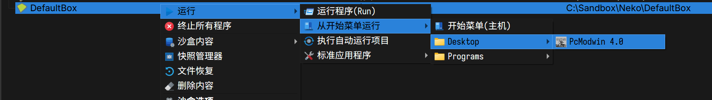
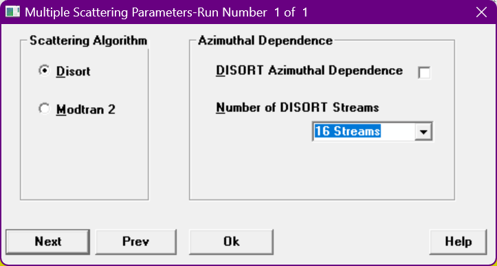
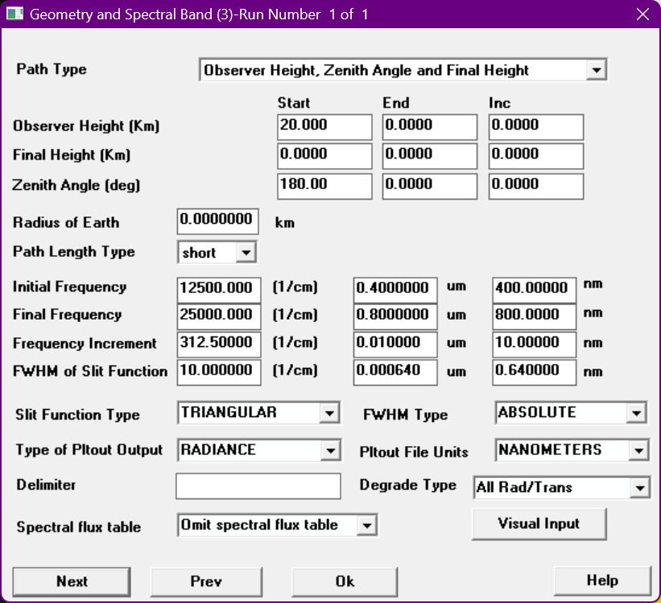
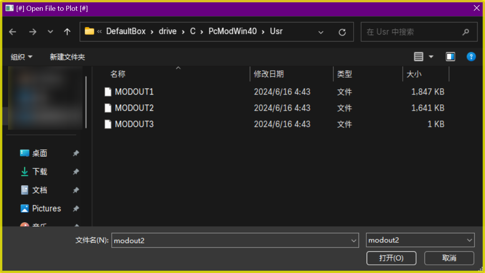
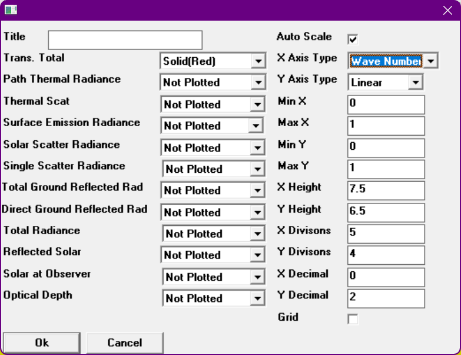
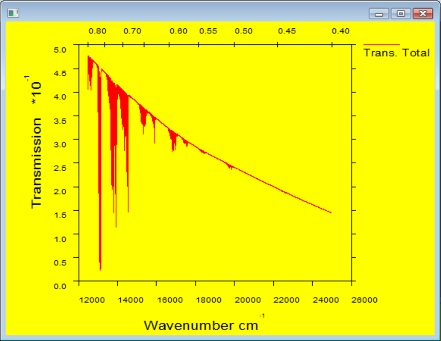
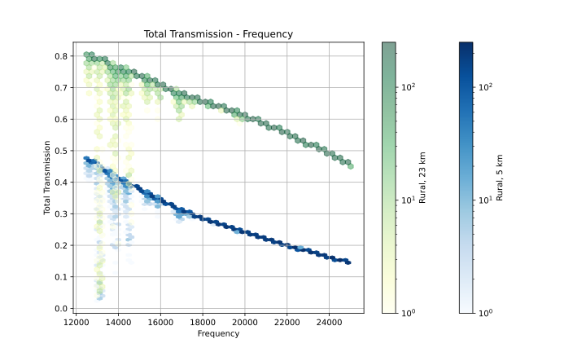
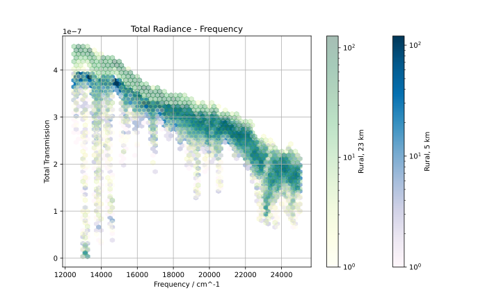
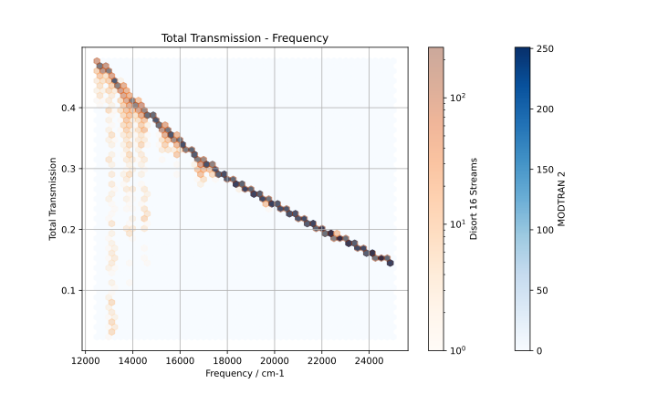
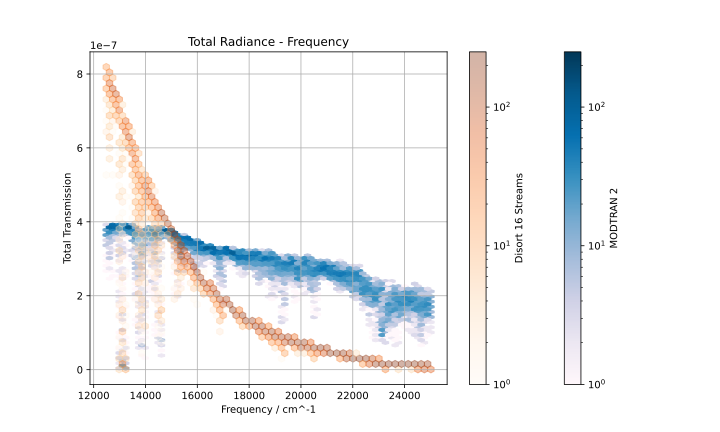

import Info from "@/components/98/Window.astro"

MODTRAN (**MOD**erate resolution atmospheric **TRAN**smission) 是一个大气辐射传输仿真软件。下面，我们将介绍如何在 Windows 11 上安装和使用 PcModWin 4.0 完成一次基本的仿真流程。

## 安装

在 Windows 11 上直接运行安装程序，会没有任何反应。

推荐使用 Sandboxie-Plus。

安装过程全部默认 <button><u>N</u>ext ></button> 即可，默认会安装到 <samp>C:\\PcModWin40\\Usr</samp>。

## 运行

在沙盒中运行：

## 仿真

### 加载模型

加载默认模型，点击 File > Open，选择 <samp>CaseM01.ltn</samp> 即可。

### 设置参数

点击 <button>Card1_input</button> 可以设置参数。

<Info title="Info: Standard Atmosphere">

6 种标准大气模式是美国空军地球物理实验室（AFGL）建立的较全面反映大气随地理和季节变化特性的参数模式：

- 1976 年美国标准大气（US Standard Atmosphere 1976）
- 热带（Tropic）
- 中纬度夏季（Mid-latitude Summer）
- 中纬度冬季（Mid-latitude Winter）
- 近北极夏季（Sub-arctic Summer）
- 近北极冬季（Sub-aratic Winter）

</Info>

第一页调整模型的大气参数。比如，可以设置大气模式为 6 种标准大气模式中的一种。

第二页默认即可。

第三页设置散射算法，默认为 <input id="radio6" type="radio" name="first-example" />
    <label for="radio6"><u>M</u>odTran 2</label>。调整为 <input id="radio5" type="radio" name="first-example" />
  <label for="radio5"><u>D</u>istort</label> 可以设置为 x 流近似。

Disort 注意事项
如果你使用 Disort，推荐设置为 16 流，其他在 Windows 11 上可能无法运行。此外，仿真时命令行可能会多次卡住，此时按下 <kbd>Ctrl</kbd> + <kbd>C</kbd> 即可。

第四页设置表面参数，默认即可。

第五页设置太阳辐射参数，默认即可。

<Info title="Info: Aerosol">

大气气溶胶粒子是指在大气中悬浮着的各种固态、液态和固液混合态的微粒，其粒径一般为 $0.001 \sim 100$ μm。气溶胶粒子既有海洋溅沫、土壤和矿物质、生物圈以及火山活动自然形成的，也有化石燃料和生物质燃烧、工农业生产等人类活动产生的。

</Info>

第六页设置气溶胶参数。第一项 Aerosol Model Used 可以设置能见度，比如 23 km 和 5 km。

第七页设置几何和光谱参数。比较重要的：

- 观测的天顶角（Zenith Angle / deg）：默认为 180，即垂直向下。
{/* - 初始频率（Initial Frequency）：默认为14000。可以根据波长设置。这里我们将第二个输入框设置为 0.4 (um)。频率和后面的 nm 单位会自动计算。 */}
- 初始频率（<label for="init-freq">Initial Frequency</label>）：默认为 <input id="init-freq" type="text" value="14000" />1/cm。可以根据波长设置。这里我们将第二个输入框设置为 0.4 (um)。频率和后面的 nm 单位会自动计算。
{/* - 最终频率（Final Frequency）：默认为 34000。可以根据波长设置。这里我们将第二个输入框设置为 0.8 (um)。频率和后面的 nm 单位会自动计算。 */}
- 最终频率（<label for="final-freq">Final Frequency</label>）：默认为 <input id="final-freq" type="text" value="34000" />1/cm。可以根据波长设置。这里我们将第二个输入框设置为 0.8 (um)。频率和后面的 nm 单位会自动计算。
{/* - 频率间隔（Frequency Increment）：默认为 100。可以根据波长设置。这里我们将第三个输入框设置为 10 (nm)。频率和 um 会自动计算。  */}
- 频率间隔（<label for="freq-inc">Frequency Increment</label>）：默认为 <input id="freq-inc" type="text" value="100" />1/cm。可以根据波长设置。这里我们将第一个输入框设置为 10。

第八页设置日月参数，可以更改太阳天顶角（Solar Zenith Angle / deg），默认为 60。

### 运行仿真

点击 Run Model > Run Modtran 即可开始仿真。

### 查看结果

## 结果分析

我们需要手动找到输出的数据。右键所用的沙盒，点击「沙盒内容」>「浏览内容」，找到 <samp>drive\C\PcModWin40\Bin\tape7</samp>，用编辑器打开。

<Info title="Info: tape7">

<samp>tape7</samp> 包含了 MODTRAN 运行的所有光谱结果的主要文件。文件中的头部信息包含将被删除的部分 <samp>tape5</samp> 信息。<samp>tape7</samp> 中的头部部分后跟着一系列光谱点及其相应的透射率。每一列都有传输或辐射的不同组成部分。

</Info>

在第 11 行开始，会有如下的 tsv 输出：

<pre style="overflow: scroll; position: relative; height: 12em; padding: 0; resize: block; max-height: 40em;">
<samp style="text-wrap: nowrap; position: absolute; margin-inline-start: 1ch;">
  FREQ   TOT TRANS  PTH THRML  THRML SCT  SURF EMIS   SOL SCAT  SING SCAT  GRND RFLT  DRCT RFLT  TOTAL RAD  REF SOL  SOL@OBS   DEPTH
 12485. 0.40669635 5.1623E-28            4.7701E-28 1.4701E-07 2.9647E-08 9.8148E-08 3.3511E-08 2.4516E-07 5.26E-07 7.54E-06   0.900
 12486. 0.47100717 5.4052E-28            5.4983E-28 2.2607E-07 3.5646E-08 1.5537E-07 5.0319E-08 3.8144E-07 7.90E-07 7.54E-06   0.753
 12487. 0.47655550 5.4059E-28            5.5366E-28 2.3468E-07 3.6231E-08 1.6162E-07 5.2165E-08 3.9630E-07 8.19E-07 7.55E-06   0.741
 12488. 0.47596380 5.3800E-28            5.5035E-28 2.3393E-07 3.6187E-08 1.6103E-07 5.1985E-08 3.9496E-07 8.16E-07 7.55E-06   0.742
 12489. 0.46592516 5.2978E-28            5.3619E-28 2.1901E-07 3.5155E-08 1.5018E-07 4.8770E-08 3.6919E-07 7.65E-07 7.55E-06   0.764
 12490. 0.47586975 5.3306E-28            5.4504E-28 2.3351E-07 3.6124E-08 1.6068E-07 5.1857E-08 3.9419E-07 8.14E-07 7.54E-06   0.743
 12491. 0.46820295 5.2572E-28            5.3372E-28 2.2171E-07 3.5269E-08 1.5213E-07 4.9327E-08 3.7384E-07 7.74E-07 7.52E-06   0.759
 12492. 0.47614878 5.2802E-28            5.4020E-28 2.3277E-07 3.5963E-08 1.6012E-07 5.1650E-08 3.9290E-07 8.11E-07 7.50E-06   0.742
 12493. 0.47661918 5.2566E-28            5.3817E-28 2.3235E-07 3.5826E-08 1.5985E-07 5.1545E-08 3.9221E-07 8.09E-07 7.46E-06   0.741
 12494. 0.47313675 5.2128E-28            5.3171E-28 2.2564E-07 3.5235E-08 1.5500E-07 5.0064E-08 3.8064E-07 7.86E-07 7.40E-06   0.748
 12495. 0.46910751 5.1711E-28            5.2468E-28 2.1801E-07 3.4557E-08 1.4947E-07 4.8385E-08 3.6747E-07 7.59E-07 7.34E-06   0.757
 12496. 0.42784721 4.9749E-28            4.7626E-28 1.6438E-07 3.0650E-08 1.1183E-07 3.8096E-08 2.7620E-07 5.98E-07 7.27E-06   0.849
 12497. 0.47309175 5.1486E-28            5.2413E-28 2.2053E-07 3.4448E-08 1.5135E-07 4.8866E-08 3.7188E-07 7.67E-07 7.23E-06   0.748
 12498. 0.46997952 5.1041E-28            5.1821E-28 2.1572E-07 3.4069E-08 1.4786E-07 4.7810E-08 3.6358E-07 7.50E-07 7.22E-06   0.755
 12499. 0.44197509 4.9391E-28            4.8502E-28 1.7983E-07 3.1514E-08 1.2214E-07 4.0420E-08 3.0197E-07 6.34E-07 7.23E-06   0.817
</samp>
</pre>

这里的数据是在不同频率时的仿真结果。你可以使用你喜欢的工具分析。注意这个输出的格式不是 tsv 之类的，需要你稍微手动编辑一下。

下面是一些例子：

### 能见度条件对比

23 km 能见度与 5 km 能见度相比，总透射辐亮度明显更高，总辐亮度略高于后者。这是因为能见度越高，光子与大气中气溶胶和气体相互作用的次数越少，光子的传播距离越远，总辐亮度越高。

### 算法对比

MODTRAN 2 算法使用原始 Isaacs 双流算法，而 DISORT 算法使用离散纵坐标近似。对于总投射辐亮度，使用 DISORT 16 流近似和 MODTRAN 2 算法的结果近似，后者给出的结果的准确度更高。对于总辐亮度，使用 16 流近似的结果更正确。

