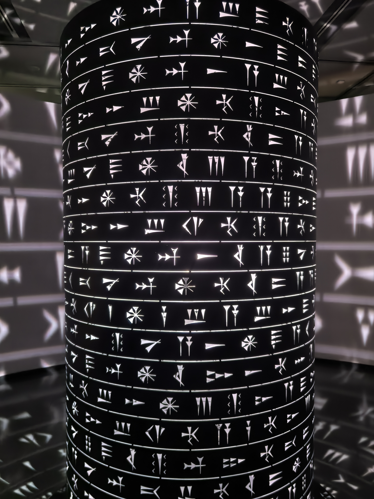
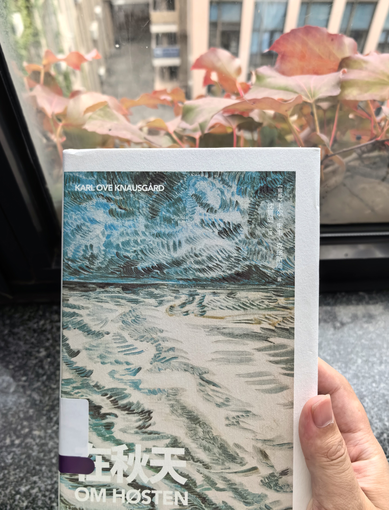

开学的第 7、8 周通常是最为繁忙的时候，实验、作业什么的都多起来了，我也被一些事情折腾得很沮丧。好不容易快捱过这一水深火热的阶段，因此只好在秋天的最后一天写下这份周报。

## 秋天的树

一到秋天，视野中满是金黄的树叶，加上明快的阳光和爽朗的天空，虽然寒冷，但也让人心情舒畅。树叶从绿变黄的过程非常短暂，虽然每棵树的进程都有差异，但这样的 progress indicator 比昼渐短夜渐长更显著，一直以来都是我对时令最直观的感受。只要全部变成金黄，就意味着秋天即将结束。

## 秋天的猫

<figure><figcaption>带出去耍</figcaption></figure>

入秋，我的手愈发干燥，但猫掉毛却渐少。猫猫似乎也不怕冷，变得更活跃了，每天夜里头欢快地奔跑。

import Character from "@/components/Character.astro";

<Character sticker="inquisitive" name="前端之猫">
<dl>
<dt>明察秋毫</dt>
<dd>目光敏锐，可以看见秋天鸟兽（猫猫）身上新长的毫毛</dd>
</dl>
</Character>

## 秋天的第一杯奶茶

今秋并没有什么好喝的新奶茶……还感觉很多品牌的品类越发地少了。

尝试了茶悦，没 get 到（而且发现以前那么多人排队可能只是因为需要到店签到后再取餐）。

这家似乎最近开了很多店。

## 秋天的画

本来没打算看展的，不过因为种种原因……

### 花

### 叙利亚

:h2[秋天的万物]{id='book'}

看《在秋天》（:i[Om Høsten]{lang="no"}）。这本随笔每篇文章以一种事物为主题，从场景描写、事物观察到情感体验，再到哲学思考，逐步深入，可以说是一部私人的词典/百科全书。全书只按月份划分为章节，不过实际上没太大联系，你可以随便翻开一夜开始读。

书中有很多只是闲言碎语，但也有不少精妙的思考。例如从邻家细伢子玩塑料武器，扮演受伤的士兵想到——

> 因为这就是战争的另一面：它简化了生活，设定好具体的目标，给所有人布置了特定的任务，并且是有明确解决方法的任务。战争不仅释放了人类潜伏的非理性力量，而且还释放了理性力量。战争既像箭头一般形式简单，又如被它所摧毁的生活一般复杂。简单而坚硬的战争游戏，帮助邻家男孩给复杂而柔软的日常生活安排秩序。今天放学回家时听到的轰鸣声，会使他充满喜悦，因为这声音承诺了某种更简单更坚硬的东西，我们所有人都曾感受过那种诱惑。

事物有的是具体的生物或物品，有的是抽象的概念。作者的结论可以很大，也可以很小——

> 靴子完全进不了水，这会让人有巨大的喜悦感……穿着结实又防水的靴子走在沼泽里，或者蹚过小溪的时候，不正是这种独立感赐予了你快乐吗？无懈可击、受到保护、自成独立实体的快乐。啊，是呀，靴子自带的属性所赋予人的幸福恰恰就在于此。

作为 ADHD，虽然常常有天马行空的想法，却又对身边的一切都反应迟钝。我想我们没有幸福感，正是因为缺少这种能注意到细节，对事物「明察秋毫」的能力吧。

import Neodb from "@/components/embed/Neodb.astro";

<Neodb item="book/om-hosten" />

最后，以书中第一章作为结尾吧：

> 孩子们同我一样吃惊，苹果树是种在花园里的物种，森林里怎么会有野生的。他们问我，能吃吗？我说，可以啊，随便拿。那一瞬间，我突然明白了自由的含义，充满幸福也充满忧伤。
